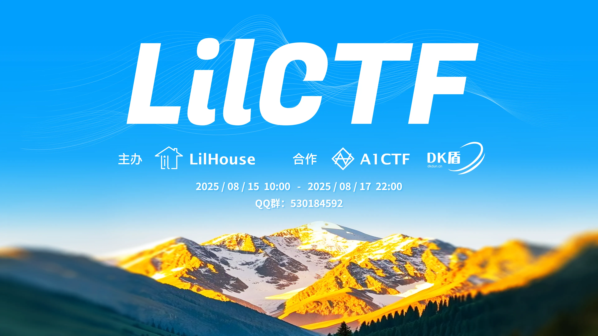

# LilCTF 2025

本仓库是 LilCTF 2025 公开赛的赛题源代码、官方题解、选手投稿题解的汇总。

LilCTF 是由 LilHouse 团队主办的网络安全夺旗赛，已于 2025-8-15 至 2025-8-17 成功举办，定位是介于新生赛（新手入门指引）与选拔性赛事（各种 XX 杯、联队招新赛）这两者之间的过渡，主要目标群体是 2024 年 9 月前后开始接触 CTF、学了一年左右的 CTFer。同时也有一些更具挑战性的题目。

## 题目列表、源代码、官方题解

见 [challenges/](./challenges/)。

## 选手投稿 Writeup

见 [players-writeup/](./players-writeup/)。

## 许可协议

选手投稿 Writeup 的内容，如无特殊说明，则遵循 [CC BY-NC-SA 4.0](https://creativecommons.org/licenses/by-nc-sa/4.0/) 协议。

除去另有说明的部分（包括但不限于选手投稿的 Writeup），本仓库内容遵循下述协议。请在使用前仔细阅读并遵守该协议。

LilCTF 2025 开源授权协议

**版权所有 © 2025 LilCTF 组委会。保留所有权利。**

本协议授予您在遵守以下条款的前提下，对本仓库内容进行有限使用的权利。

**1. 授权范围**

您被授予以下非排他性的权利：

  a. **个人使用**：以个人学习、研究、复现为目的，在本地或私有环境中下载、编译、运行和修改本仓库中的题目源代码及相关材料。

  b. **公共复现**：在**完全免费**且**非商业**的公开在线平台（如CTF练习平台）上部署、上线本仓库中的题目。前提是，必须在题目展示页面的显著位置清晰标注“题目来源：LilCTF”并提供一个有效的、指向本 GitHub 仓库的超链接。

  c. **模板借鉴**：将本仓库中的题目设计、代码结构作为您原创题目的灵感或模板。但您最终创作的题目，必须在**核心考点、关键解题思路以及主要代码实现**上与本仓库的原始题目存在本质性的区别和创新。直接或轻微修改后用于其他比赛的行为是不被允许的。

**2. 限制条件**

  a. **禁止商业使用**：严禁将本仓库的任何部分用于任何形式的商业活动，包括但不限于：作为付费产品或服务的一部分、用于商业培训、在需要付费才能访问的平台上发布、举办商业性比赛等。

  b. **保留署名**：在任何形式的再分发或展示中，都必须保留原始的版权声明和作者信息。

**3. 免责声明**

本仓库按“原样”提供，不附带任何明示或暗示的保证。对于因使用或无法使用本仓库内容而导致的任何直接或间接损害，作者和组委会不承担任何责任。

**4. 权利保留**

所有未在本协议中明确授予您的权利，均由 LilCTF 组委会保留。我们保留随时修改本协议条款以及对违反本协议的行为进行追究的权利。

## 替代托管站

为使访问本仓库内容不因任一平台的故障或政策变更而受到影响，本仓库可从以下托管平台访问：

- https://github.com/Lil-House/LilCTF-2025
- https://gitee.com/Lil-Ran/LilCTF-2025
- https://gitcode.com/Lil-Ran/LilCTF-2025

以上链接对应仓库内容由 LilRan 管理，保持同步更新，通过任一平台的拉取请求（Pull Request）会平等地被处理。

## 致谢

感谢 [DK 盾 | 林枫云](https://www.dkdun.cn/) 为比赛提供服务器基础设施。

感谢 [CarboFish](https://github.com/carbofish) 师傅开发 [A1CTF](https://github.com/carbofish/A1CTF) 平台并提供技术支持。
